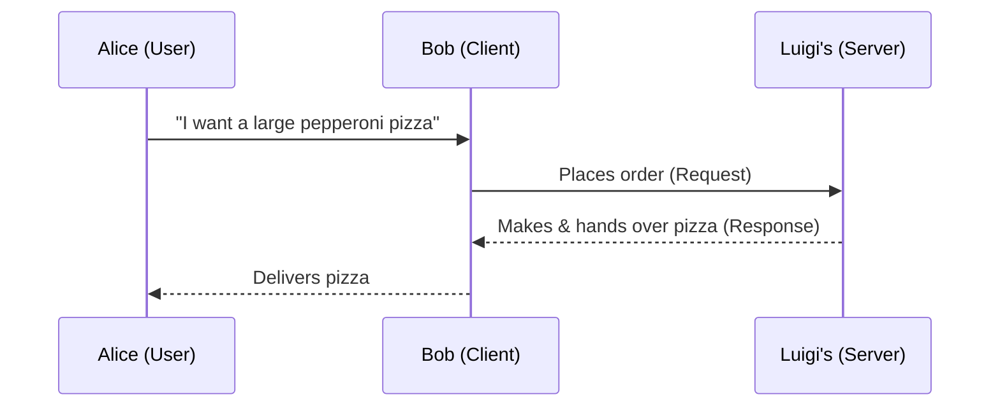
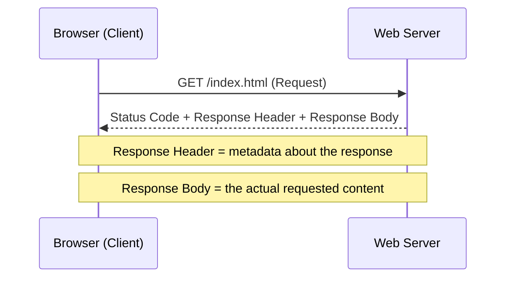

# 🌐 Client-Server Basics

> [!info] Room Info
> **Difficulty:** Easy · **Time:** ~60 min · **Module:** Computer Fundamentals
> Goal: Understand the Client-Server model and get a surface-level grasp of DNS, Client, Server, Port, Protocol, and Network — then see it in action via a real HTTP GET request.

---

## 1. Introduction

Early computers worked **in isolation** — storing their own files, running their own programs, with no communication between machines. Over time, organizations began interconnecting systems to enable information exchange and resource sharing across distance. Early networks like **ARPANET**, **CYCLADES**, **NPL**, and **NSFNET** were the precursors to the modern internet.

As systems became interconnected, they began to **specialize** — much like people in society specializing in a skill and offering it as a service. This room explains *how* computer systems use each other's services: the **Client-Server model**.

### Learning Objectives
- Understand the **Client-Server model**
- Surface-level understanding of: **DNS**, **Client**, **Server**, **Port**, **Protocol**, **Network**

### Prerequisites
- [[Inside a Computer System]]
- [[Computer Types]]

> [!question]- 🧪 Quick Quiz: Introduction
> 1. Why did organizations start interconnecting isolated computer systems?
> 2. Name two early precursor networks to the modern internet.
>
> **Answers**
> 1. To facilitate information exchange and resource sharing regardless of distance.
> 2. Any two of: ARPANET, CYCLADES, NPL, NSFNET.

---

## 2. Pizza Delivery — The Client-Server Analogy

> [!quote] The Scenario
> Alice wants pizza. She tells Bob what she wants. Bob drives to Luigi's, places the order ("a large pepperoni pizza and a coke"), waits, and brings it back. Simple — but every step maps directly onto how computer systems talk to each other.

### Mapping the Analogy to Computer Systems

| Analogy Element | Computer Concept | Explanation |
|---|---|---|
| **Alice → Bob → Luigi's** | Client → Server | **Bob is the client** — he initiates the request on Alice's behalf, same as a browser requesting a webpage on your behalf. **Luigi's is the server** — it fulfills the request. |
| **Bob placing the order** | Request | The client always initiates the request — the server never reaches out first. |
| **Luigi's making/handing over the pizza** | Response | If the request is malformed or unavailable (e.g. "no pepperoni left"), the server sends back an **error response** instead. |
| **The shared language/menu Bob and Luigi's use** | Protocol | Defines: which commands are understood (e.g. `GET`), how a request is structured, what syntax to use, what response to give for valid vs. faulty requests. |
| **A specific door for takeaway vs. dine-in vs. delivery** | Port | A server can run multiple services simultaneously; each is reached through a different **port**, just like different doors for different services at Luigi's. |
| **Bob using GPS to find Luigi's from just a name** | DNS | Resolves a human-readable name (e.g. a website name) into the actual location — an **IP address** — the same way GPS resolves "Luigi's Pizza" into map coordinates. |

> [!tip] Core Rule
> **The client always initiates the request.** The server only responds — it doesn't reach out on its own.

### Key Concepts Defined

- **Service, Client, Server:** The client requests a service; the server provides it. (Browser = client, website's system = server.)
- **Request & Response:** A request can fail if malformed or if the resource is unavailable — resulting in an **error response**.
- **Protocol:** The full rulebook for client-server communication — commands understood, request structure, syntax, valid responses, and error responses.
- **Port:** Identifies *which specific service* on a server a client wants to reach (a server can run many services, each on its own port).
- **DNS (Domain Name Service):** Resolves a human-readable name into an **IP address** — the machine-usable "address" of a server, analogous to a full street address for a computer.

> [!question]- 🧪 Quick Quiz: Pizza Delivery Analogy
> 1. In the analogy, who is the client and who is the server? Why?
> 2. What happens if a request is malformed or the requested item isn't available?
> 3. What four (or five) things does a protocol actually define?
> 4. Why does a server need multiple ports if it offers multiple services?
> 5. What does DNS resolve a name *into*?
> 6. True or false: the server can initiate a request to the client.
>
> **Answers**
> 1. Bob is the client (he initiates the request on Alice's behalf); Luigi's is the server (it fulfills the request).
> 2. The server/system returns an **error response** instead of the expected result.
> 3. Which commands are understood, how a request is structured, what syntax is used, what response to give for valid requests, and what response to give for faulty requests.
> 4. So each service can be reached independently — one port per service, like one door per service at Luigi's.
> 5. An IP address (the server's actual network location).
> 6. False — the client always initiates; the server only responds.

---

## 3. Web Communication in Practice (HTTP)

### HTTP(S) — Stateless by Design

**HTTP(S)** (Hypertext Transfer Protocol (Secure)) is the client-server protocol behind the World Wide Web. It's **stateless**: each request is processed independently — the server doesn't remember previous requests on its own.

> [!warning] Statelessness Has a Catch
> Since HTTP itself has no memory, modern websites add **statefulness at the application level**. Example: when you log in, the server issues a **session identifier** (stored in a cookie or token), sent along with every subsequent request. Without this mechanism, you'd have to re-authenticate on *every single request* — the server would have zero memory of your last login.

### The 9 Core HTTP Methods (Commands)

In HTTP, "commands" are called **methods**. There are 9 core ones defined in the HTTP specification (RFCs):

| Method | # |
|---|---|
| `GET` | 1 |
| `POST` | 2 |
| `PUT` | 3 |
| `DELETE` | 4 |
| `PATCH` | 5 |
| `HEAD` | 6 |
| `OPTIONS` | 7 |
| `CONNECT` | 8 |
| `TRACE` | 9 |

This room focuses on **GET** — the most common method, used to **retrieve** a resource from a web server.

> Example: `GET https://tryhackme.com/index.php` retrieves TryHackMe's homepage. You don't type this manually — your browser (the client) constructs this request behind the scenes from what you type (e.g. `https://tryhackme.com`) plus other fields defined by the HTTP spec.

### Request/Response Flow for a GET Request

### Inspecting a Real GET Request (Lab Walkthrough)

**Setup:** Start the lab machine → open Firefox → navigate to `http://httpdemo.local:8080` → open Developer Tools (`F12` or right-click → Inspect) → go to the **Network** tab → reload the page → click the first request entry.

**Fields you'll see in the request details:**

| Field | Meaning | Example |
|---|---|---|
| **Scheme** | Which protocol was used | HTTP or HTTPS |
| **Host** | The name of the host the resource is requested from | `httpdemo.local` |
| **Filename** | Which file was requested from the host | `/` (which actually resolves to `index.html`) |
| **Address** | The IP address where the website is hosted | `127.0.0.1` (in this lab, hosted locally) |
| **Status** | Whether the request succeeded | `200 OK` = success |

**Response structure:**
- **Response Header** — metadata about the response (not the content itself)
- **Response Body** — the actual requested content (e.g. the page's HTML, viewable under the "Response" tab in DevTools)

> [!question]- 🧪 Quick Quiz: Web Communication in Practice
> 1. What does it mean that HTTP is "stateless"?
> 2. How do modern websites work around HTTP's statelessness to keep you logged in?
> 3. How many core HTTP methods are defined, and what's the term HTTP uses instead of "command"?
> 4. What does the `GET` method do?
> 5. In DevTools' Network tab, what does the "Status" field of `200` mean?
> 6. What's the difference between the response header and the response body?
>
> **Answers**
> 1. Each request is handled independently — the server doesn't retain memory of previous requests by default.
> 2. Via session identifiers (cookies/tokens) sent with each request after login, adding statefulness at the application level.
> 3. 9 core methods; HTTP uses the term **method** instead of "command."
> 4. It retrieves a resource from a web server.
> 5. The request was successful ("200 OK").
> 6. The header contains metadata about the response; the body contains the actual requested content (e.g. the HTML).

---

## 4. Conclusion

> [!note] Not Yet Pasted
> Task 4 (Conclusion) content hasn't been added yet — paste it in whenever you complete it and I'll fold it into this section.

- [ ] Add Task 4 content here

---

## 🧠 Key Takeaways
- The **Client-Server model**: client initiates a request, server responds — never the other way around.
- Six core building blocks: **Client, Server, Request/Response, Protocol, Port, DNS.**
- **Protocol** = the full rulebook of communication (commands, structure, syntax, valid/error responses).
- **Port** identifies *which service* on a server you're talking to; **DNS** resolves a name into an **IP address**.
- **HTTP is stateless** — each request stands alone; real-world "logged in" experiences are built on top via session cookies/tokens.
- `GET` is the HTTP method for **retrieving** a resource; the browser constructs the actual request behind the scenes.
- A response = **status code + header (metadata) + body (actual content)**.

## 📝 Full Module Recap Quiz
> [!question]- End-to-End Review (test yourself without peeking at the sections above)
> 1. Walk through the Pizza Delivery analogy and map each element (Alice, Bob, Luigi's, the order, the menu/language, the doors, the GPS) to its computer-networking equivalent.
> 2. What are the six core concepts this room set out to teach, and define each in one sentence.
> 3. Why is HTTP described as stateless, and how do real websites work around this?
> 4. Name all 9 HTTP methods. Which one did this room focus on, and what does it do?
> 5. What three things make up an HTTP response?
> 6. What tool (built into the browser) was used to inspect a live GET request, and which tab was used?

## 🔗 Related Notes
- [[Inside a Computer System]]
- [[Computer Types]]
- [[Offensive Security Intro]]
- [[DNS]]
- [[HTTP Protocol]]
- [[Ports and Services]]
- [[Computer Fundamentals MOC]]

## 📌 Next Steps
- [ ] Paste Task 4 (Conclusion) content once completed
- [ ] Try inspecting a real GET request on a site you use daily via DevTools → Network tab, and identify Scheme, Host, Filename, Address, and Status yourself
- [ ] Revisit quiz sections for spaced repetition
