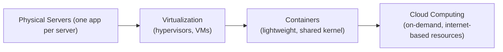
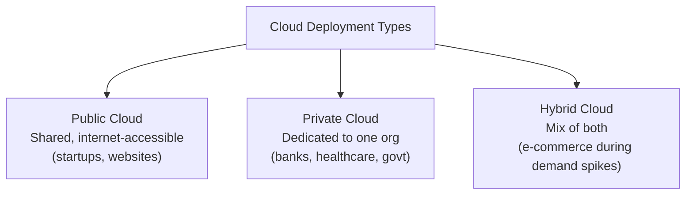
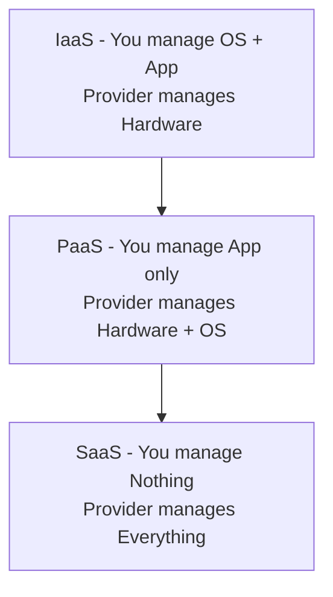

# ☁️ Cloud Computing

> [!info] Room Info
> **Module:** Computer Fundamentals
> Goal: Understand what cloud computing is, its service models (IaaS/PaaS/SaaS), deployment types (Public/Private/Hybrid), and its core benefits.

---

## 1. Introduction

> [!quote] The Problem
> You built an app to help students practice cyber security, hosted on your own computer in your own country. Users elsewhere experience lag. Many students connecting at once overwhelms it. If your computer's off, the app's off. These limits cap growth.

**Cloud computing** solves exactly this. It's built **on top of** technologies you've already covered — [[Virtualization]] and containers — which let many applications run efficiently on shared infrastructure and let environments be created/changed quickly on demand.

### Learning Objectives
- What is cloud computing
- Service models of cloud: **IaaS, PaaS, SaaS**
- Cloud types: **Private / Public / Hybrid**
- Benefits of cloud computing

---

## 2. Cloud Computing Overview

Cloud computing solves the exact problem above — instead of running your app on one computer in one country, the cloud lets you use computing resources **over the internet**, making your application easier to access, more reliable, and ready to scale as usage grows.

### How Servers Evolved to Cloud

Cloud computing didn't appear overnight — it's the result of years of change in how servers were used and managed, as businesses continually looked to reduce costs, use resources more efficiently, and simplify running/scaling applications.

> [!tip] Connect the Dots
> This is the same progression from the [[Virtualization]] note — cloud computing is the *next layer* built on virtualization and containers, not a separate, unrelated technology.

### Cloud Benefits & Characteristics

The cloud was designed to address common problems: limited capacity, high costs, slow growth.

| Benefit | What It Means |
|---|---|
| **Scalability** | Easily scale up or down as your application's needs change |
| **On-demand self-service** | Create or remove servers/storage instantly, without waiting for hardware |
| **Pay only for what you use** | Charged based on usage, not upfront costs |
| **Security** | Cloud providers protect infrastructure with strong security measures |
| **High availability** | Applications keep running even if part of the system fails |
| **Global access** | Application accessible by users anywhere in the world |

> [!success] In Simple Terms
> The cloud makes IT resources **flexible, cost-effective, and easier to manage.**

> [!question]- 🧪 Quick Quiz: Cloud Overview
> 1. What two technologies does cloud computing build on top of?
> 2. What problem does cloud computing solve compared to hosting an app on a single personal computer?
> 3. Name all six core cloud benefits/characteristics.
> 4. What does "on-demand self-service" mean in practice?
>
> **Answers**
> 1. Virtualization and containers.
> 2. Limits like lag for distant users, inability to handle many simultaneous users, and total downtime if the single machine is off — the cloud removes these limits via distributed, always-on infrastructure.
> 3. Scalability, on-demand self-service, pay only for what you use, security, high availability, global access.
> 4. You can create or remove servers/storage instantly, without waiting on physical hardware procurement or setup.

---

## 3. Types of Cloud (Deployment Models)

| Type | Best For | Why |
|---|---|---|
| **Public Cloud** | Startups, websites, global apps | Affordable, easy to scale, no infrastructure management required |
| **Private Cloud** | Banks, healthcare, government | Greater control, customization, and compliance for sensitive data |
| **Hybrid Cloud** | E-commerce platforms | Keeps sensitive data private while still scaling publicly during high demand |

---

## 4. Cloud Service Models (IaaS / PaaS / SaaS)

These describe *how much* you manage vs. how much the provider manages.

| Model | You Manage | Provider Manages | Example |
|---|---|---|---|
| **IaaS** (Infrastructure as a Service) | OS + your application | Physical hardware | Renting virtual servers, storage, networking |
| **PaaS** (Platform as a Service) | Just your application | Infrastructure + OS | Build/deploy/run apps without touching servers |
| **SaaS** (Software as a Service) | Nothing (just use it) | Everything | Gmail, Zoom — full application via browser/app |

> [!tip] Renting an Apartment Analogy
> - **IaaS** ≈ renting an empty apartment (walls + utilities) — you bring and manage everything inside.
> - **PaaS** ≈ renting a furnished apartment — the heavy lifting (structure, furniture) is done, you just live your life (build your app).
> - **SaaS** ≈ staying at a hotel — everything is fully managed and ready to use immediately, no setup at all.

> [!question]- 🧪 Quick Quiz: Deployment & Service Models
> 1. Which cloud deployment type would a bank most likely use, and why?
> 2. Which deployment type suits an e-commerce site needing to scale during a sale while keeping customer data private?
> 3. In IaaS, who manages the operating system — you or the provider?
> 4. What's the core difference between PaaS and SaaS?
> 5. Give a real example of a SaaS product.
>
> **Answers**
> 1. Private Cloud — for greater control, customization, and regulatory compliance over sensitive data.
> 2. Hybrid Cloud — private for sensitive data, public for scaling during demand spikes.
> 3. You (the customer) manage the OS in IaaS; the provider only manages the physical hardware.
> 4. PaaS gives you a ready environment where you still build/deploy your own app; SaaS gives you the finished application itself, with nothing to build or manage.
> 5. Gmail or Zoom.

---

## 5. Major Cloud Vendors

| Vendor | Known For |
|---|---|
| **AWS** (Amazon Web Services) | Industry leader — most extensive offerings, global reach |
| **Microsoft Azure** | Strong in enterprise and hybrid cloud environments |
| **Google Cloud Platform (GCP)** | Powerful data analytics, AI, and machine learning tools |
| **Alibaba Cloud** | Major player in Asia, competitive globally |
| **IBM Cloud** | Hybrid cloud and AI-driven solutions |
| **Oracle Cloud** | Enterprise applications and databases |

> [!note] AWS's `EC2` (Elastic Compute Cloud)
> Amazon's cloud computers — virtual servers you can quickly create, use, and resize whenever needed. Covered in the room's key terminology.

### Real-World Cloud Usage

| Company | How They Use the Cloud |
|---|---|
| **Netflix** | Runs entirely on AWS — scales globally, stays online during peak demand, streams reliably to millions simultaneously |
| **Spotify** | Handles millions of songs/users, scales quickly for new releases/features |
| **Instagram** | Stores massive volumes of photos/videos, delivers them fast worldwide |
| **Online stores** | Handle traffic spikes (e.g. Black Friday) without buying permanent infrastructure |

> [!success] Why They Do This
> Easy scaling, reduced costs, reliability, and the ability to focus on the product instead of managing hardware.

> [!question]- 🧪 Quick Quiz: Vendors & Real-World Use
> 1. Which cloud vendor is the current industry leader?
> 2. Which vendor is particularly known for AI/ML and data analytics tools?
> 3. What AWS service lets you quickly create and resize virtual servers?
> 4. Why does Netflix run entirely on AWS?
> 5. Why would an online store use the cloud instead of owning permanent infrastructure for Black Friday traffic?
>
> **Answers**
> 1. AWS (Amazon Web Services).
> 2. Google Cloud Platform (GCP).
> 3. EC2 (Elastic Compute Cloud).
> 4. To scale globally, stay online during peak demand, and stream reliably to millions of users at once.
> 5. Buying permanent infrastructure for a short traffic spike is wasteful — the cloud lets them scale up temporarily and pay only for what they use.

---

## 6. Conclusion

Cloud computing enables **flexible, scalable, and cost-effective** access to computing resources.

### Key Terminology Recap

| Term | Definition |
|---|---|
| **Public Cloud** | Cloud services accessed over the internet, shared by many people/companies |
| **Private Cloud** | A cloud built for one company, offering more control and security |
| **Hybrid Cloud** | A mix of public and private clouds that work together and share data |
| **IaaS** | Renting basic computer parts (servers, storage) from the cloud |
| **PaaS** | A ready-to-use environment to build/run apps without managing servers |
| **SaaS** | Software used online without installing anything (e.g. Gmail, Zoom) |
| **EC2** | Amazon's cloud computers — quickly create, use, and resize as needed |

### Key Benefits (Recap)
Scalability · On-demand self-service · Pay only for what you use · Security · High availability · Global access

---

## 🧠 Key Takeaways
- Cloud computing solves the scaling/reliability/access problems of running an app on a single machine — and it's built on top of **virtualization and containers**, not a separate concept.
- Three **deployment types**: Public (shared, cheap, scalable), Private (dedicated, controlled, compliant), Hybrid (mix of both).
- Three **service models**: IaaS (rent infrastructure), PaaS (rent a ready platform), SaaS (rent the finished software) — each shifts more management responsibility onto the provider.
- **AWS** is the current market leader; Azure, GCP, Alibaba Cloud, IBM Cloud, and Oracle Cloud are major alternatives, each with different strengths.
- Real companies (Netflix, Spotify, Instagram, online retailers) use the cloud specifically for **scalability, cost efficiency, and reliability** — letting them focus on their product instead of hardware.

## 📝 Full Module Recap Quiz
> [!question]- End-to-End Review (test yourself without peeking at the sections above)
> 1. What two prior concepts does cloud computing build on?
> 2. List and briefly describe the three cloud deployment types.
> 3. List and briefly describe the three cloud service models, using the apartment-renting analogy.
> 4. Name three cloud vendors and one thing each is known for.
> 5. List all six cloud computing benefits.
> 6. What is EC2?
> 7. Pick one real-world company example and explain why cloud computing suits their use case.

## 🔗 Related Notes
- [[Virtualization]]
- [[Inside a Computer System]]
- [[Computer Types]]
- [[Client-Server Basics]]
- [[Offensive Security Intro]]
- [[AWS]]
- [[Computer Fundamentals MOC]]

## 📌 Next Steps
- [ ] Explore AWS Free Tier and spin up a basic EC2 instance to see IaaS hands-on
- [ ] Compare a PaaS product (e.g. Heroku) vs. a SaaS product (e.g. Gmail) side by side
- [ ] Revisit quiz sections for spaced repetition
