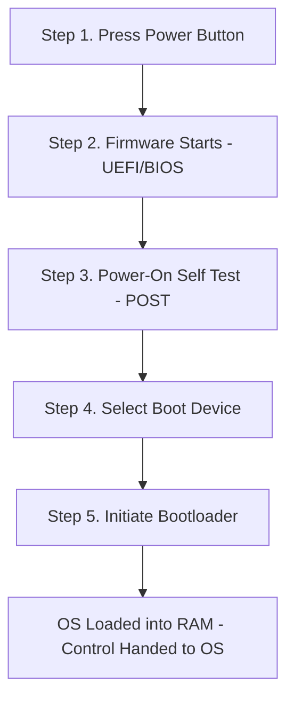

# 🖥️ Inside a Computer System

> [!info] Room Info
> **Difficulty:** Easy · **Time:** ~45 min · **Module:** Computer Fundamentals (Room 1)
> Goal: Understand the core building blocks of a computer system and how it boots up — foundational knowledge before diving into security concepts.

---

## 1. Introduction

> [!quote] Analogy
> Before protecting a castle, you need to know its layout — where the treasure room, food storage, and commander's quarters are, and who can enter each. **You can't defend what you don't understand.**

This room builds a mental model of a computer system: its parts, and how they connect and cooperate.

**Learning objective:** Recognize and understand the function of various computing components.

---

## 2. Core Components of a Computer System

> [!tip] Analogy Used
> Components are mapped to parts of the **human body** to make them intuitive — e.g. CPU ≈ brain, RAM ≈ short-term memory, storage ≈ long-term memory, PSU ≈ heart/circulatory system.

| Component | Function | Body Analogy |
|---|---|---|
| **CPU** (Central Processing Unit) | Executes instructions; the "brain" of the system | Brain |
| **RAM** (Random Access Memory) | Fast, volatile working memory for active tasks | Short-term memory |
| **Storage** (HDD/SSD) | Persistent, long-term data storage | Long-term memory |
| **Motherboard** | Connects and allows communication between all components | Nervous system / skeleton |
| **PSU** (Power Supply Unit) | Supplies power to all components | Heart / circulatory system |
| **GPU** | Handles graphics/visual rendering | Eyes / visual cortex (loose analogy) |

> [!question]- 🧪 Quick Quiz: Core Components
> 1. Which component is often compared to the human brain, and why?
> 2. What's the key difference between RAM and storage in terms of *volatility*?
> 3. What role does the motherboard play in the system?
> 4. Why is the PSU critical to every other component functioning?
>
> **Answers**
> 1. CPU — it executes instructions and makes decisions, like the brain processes thought.
> 2. RAM is volatile (loses data when powered off, used for active/temporary tasks); storage is non-volatile (retains data permanently).
> 3. It's the central connector/communication backbone linking all components together.
> 4. Without power from the PSU, no other component can operate at all.

---

## 3. What Happens When You Press the Start Button? (Boot Process)

> [!quote] Analogy
> Booting up a computer ≈ waking up your body: power on → systems initialize → self-check → find the way to "consciousness" (the OS).

### The Boot Sequence

| Step | What Happens |
|---|---|
| **1. Press Power Button** | Signal sent to the **PSU**, allowing power to flow to components. |
| **2. Firmware Starts** | The **UEFI** (Unified Extensible Firmware Interface) initializes and manages component startup. *(UEFI is the modern replacement for the older BIOS — same purpose.)* |
| **3. Power-On Self Test (POST)** | A routine loaded by UEFI that checks every required component is present, correctly configured, and functioning. |
| **4. Select Boot Device** | UEFI holds an **ordered priority list** of devices to check for a bootable OS. |
| **5. Initiate Bootloader** | On the selected device, the bootloader loads and transfers the OS into **RAM**; UEFI then hands control over to the OS. |

> [!warning] Security Relevance
> The boot process is a real attack surface — concepts like **bootkits**, **UEFI/BIOS attacks**, and **Secure Boot** bypasses target this exact sequence. Worth revisiting once you get into more advanced topics. See [[Boot Security]] / [[UEFI]].

> [!question]- 🧪 Quick Quiz: Boot Process
> 1. Put these in correct order: POST, Bootloader initiation, Power button press, Boot device selection, Firmware start.
> 2. What has UEFI mostly replaced, and do they serve the same purpose?
> 3. What does POST actually check for?
> 4. Where does the bootloader transfer the OS to, and who has control after that?
> 5. Name one type of attack that specifically targets the boot process.
>
> **Answers**
> 1. Power button press → Firmware start → POST → Boot device selection → Bootloader initiation.
> 2. UEFI has mostly replaced BIOS; yes, they serve the same core purpose (firmware managing startup).
> 3. Whether every required component is present, correctly configured, and functioning.
> 4. Into RAM; after that, the OS takes control from the UEFI.
> 5. A bootkit (malware that infects the boot process/firmware).

---

## 4. Conclusion

- You now know the **core components** of a computer system and the **boot sequence**.
- This knowledge is foundational — you'll keep referring back to it (component functions, boot process) as you move into deeper security topics.
- **Next room:** *Computer Types* — covers how different combinations/specializations of these components produce different types of computer systems.

---

## 🧠 Key Takeaways
- A computer system is made of interdependent building blocks (CPU, RAM, storage, motherboard, PSU, GPU) — each with a distinct role, much like organs in a body.
- **UEFI** (modern) / **BIOS** (legacy) is the firmware layer that initializes hardware and hands off control to the OS.
- Boot sequence: **Power → Firmware (UEFI) → POST → Select Boot Device → Bootloader → OS in RAM**.
- The boot process isn't just trivia — it's a genuine target for attackers (rootkits/bootkits), which is why understanding it matters for security work later.

## 📝 Full Module Recap Quiz
> [!question]- End-to-End Review (test yourself without peeking at the sections above)
> 1. List all core computer components covered and their one-line function.
> 2. Walk through the 5-step boot sequence from memory.
> 3. What's the difference between BIOS and UEFI?
> 4. Why does the analogy "you can't defend a castle you've never seen" apply to computer security?
> 5. What's one real-world security concern tied to the boot process?

## 🔗 Related Notes
- [[Offensive Security Intro]]
- [[Computer Types]] (next room)
- [[UEFI]]
- [[Boot Security]]
- [[Computer Fundamentals MOC]] <!-- Map of Content for the whole module -->

## 📌 Next Steps
- [ ] Revisit the quiz sections weekly for spaced repetition
- [ ] Continue to *Computer Types* room
- [ ] Skim UEFI/BIOS docs for a deeper technical pass later
