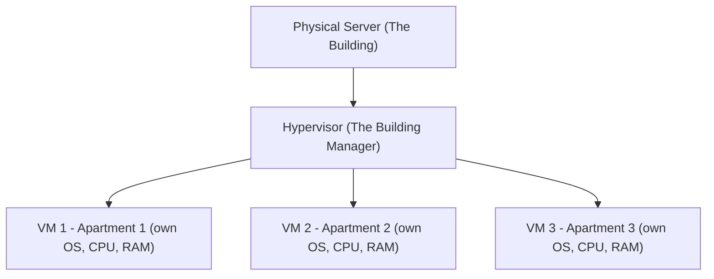
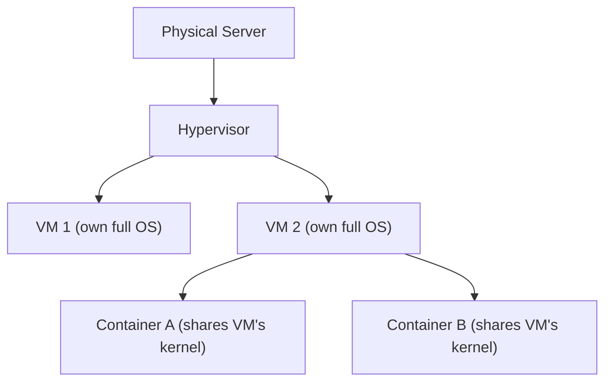

# 🏢 Virtualization

> [!info] Room Info
> **Module:** Computer Fundamentals
> Goal: Understand why running one application per physical server is inefficient, how **virtualization** solves this, the components of a virtual/lab machine, and how **containers** further optimize hardware utilization.

---

## 1. Introduction

Previous rooms covered computer components and how computers communicate. This room covers how companies **optimize** those components to reduce cost and build flexible, scalable systems — the concept of **virtualization**, which powers most of the modern internet.

> [!quote] The Problem
> How expensive and inefficient would it be if every piece of software or every website needed its own dedicated physical server? **Virtualization exists to solve exactly this problem.**

### Learning Objectives
- Understand why managing applications on individual physical servers is inefficient
- Learn how virtualization addresses hardware utilization and scalability challenges
- Understand the components of a lab machine (VM)
- Learn how containers further optimize hardware utilization for applications

---

## 2. Virtualization Overview

### The Old Rule: "One Server = One Application"

In early IT, each physical machine had one clear purpose (host a website, store data, etc.). As businesses added more services, they simply added more physical servers.

> [!warning] Problems With "One Job Per Box"
> - **High cost** — buying multiple physical servers means paying for hardware *and* electricity, cooling, maintenance, and data center space
> - **Low utilization** — most applications don't use full server capacity; many servers sat at just **5–20% usage**, wasting CPU/memory/storage
> - **Slow deployment** — setting up new physical servers could take days or weeks
> - **Hard to scale** — needing more resources often meant buying an entirely new server

**Bottom line:** companies were paying a lot for hardware that wasn't being fully utilized.

### The Solution: Share Hardware Safely

> [!tip] The Key Idea
> "What if multiple applications could share the same physical server safely?"

A **hypervisor** was introduced as a virtualization layer — acting like a referee between virtual machines, letting each one behave independently, like its own physical computer.

### The Building Analogy

| Analogy | Real Concept |
|---|---|
| The building | The physical server |
| The apartments | Lab Machines (VMs) |
| The tenants | Applications or operating systems |
| The building manager | The hypervisor |

> [!example] One Person, 10 Floors vs. Many Apartments
> **One tenant in a whole 10-floor building:** uses only one floor, but must maintain the entire building (electricity, cleaning, water, security) — most of the building sits empty and wasted. Expensive and inefficient.
>
> **Same building divided into apartments:** each has its own door, walls, kitchen, and privacy. Different people live independently without interfering with each other, while all sharing the building's core infrastructure (electricity, water, elevators) — cheaper and more efficient for everyone.

Each **Lab Machine (VM)** acts as an independent system with its own OS, apps, and settings — even though they all share the same underlying physical hardware.

> [!question]- 🧪 Quick Quiz: Virtualization Overview
> 1. What was the old "rule of thumb" in IT before virtualization?
> 2. Name all four problems with the "one server = one application" approach.
> 3. What percentage range of usage did many under-utilized servers sit at?
> 4. In the building analogy, what does the hypervisor represent?
> 5. What key property does each VM retain even though it shares physical hardware with others?
>
> **Answers**
> 1. "One server = one application."
> 2. High cost, low utilization, slow deployment, hard to scale.
> 3. 5–20% usage.
> 4. The building manager — the software layer that safely divides and manages the shared resource.
> 5. Independence — its own OS, apps, and settings, isolated from other VMs.

---

## 3. Virtualization Components

### Hypervisor (The Building Manager)

The **hypervisor** is the core technology behind virtualization — the software that creates and manages VMs. It:

- Divides a physical computer into multiple virtual ones
- Gives each VM its own share of CPU, memory, and storage
- Keeps everything isolated and safe
- Manages the VM lifecycle: start, stop, pause, clone, delete

### Two Types of Hypervisors

| Type | Runs On | Best For |
|---|---|---|
| **Type 1** | Directly on physical hardware | Fast, efficient — servers, professional/production environments |
| **Type 2** | Within an existing operating system | Easier to install — learning, testing, small setups |

> [!note] Use Cases Are Flexible, Not Fixed
> Any use case *can* run on either hypervisor type — but each has a best fit given its objectives.

| Use Case | Type 1 | Type 2 |
|---|:---:|:---:|
| Test Malicious Files | | ✅ |
| Production Server | ✅ | |
| Database Server | ✅ | |
| Software Testing | | ✅ |
| Kali Linux | | ✅ |
| Data Center | ✅ | |

> [!warning] Testing Malware Safely
> When testing malicious files via virtualization, take care that the **host** machine doesn't get infected by malware running in the **guest** VM. Approaches: use a different OS for guest vs. host, or fully isolate the guest so it can't communicate with the host.

### Lab Machines / VMs (The Apartments)

A **Lab Machine (VM)** is a virtual computer created by the hypervisor. Even though virtual, it behaves like a real machine:

- Has its own virtual CPU, RAM, storage, and network
- Can run **any** operating system (Windows, Linux, etc.)
- Is **completely isolated** from other VMs — if one breaks, the others keep working

You can run VMs locally with tools like **Oracle VirtualBox** or **VMware Workstation** — these act as Type 2 hypervisors, letting you run multiple OSes (Windows, Linux, macOS) on one machine.

> [!example] When You'd Actually Use a VM
> - Need to work on a different OS (e.g. Kali Linux) without buying new hardware → install a hypervisor, run a Kali Linux VM
> - Want to test if a file is malicious → set up an isolated lab machine to protect your main computer

### Containers (The Rooms Inside the Apartment)

A **container** is a lightweight, isolated environment that runs a single application plus everything it needs to run. Instead of bringing an entire separate OS, a container shares the host's **kernel** — the part of the OS that talks to hardware and manages resources like memory and running programs.

> [!warning] The Trade-off
> Because containers share the host's kernel, they start fast and use fewer resources than full VMs — **but** they must match the host system's OS type. You can't run a Windows container on a Linux machine.

**Containers behave like small, self-contained spaces because they:**
- Package the application and its dependencies (libraries, tools, versions)
- Share the host's OS, so they start almost instantly
- Remain isolated from each other — a misbehaving container doesn't affect others
- Run consistently on any (compatible) machine — great for development, testing, scalable deployments

The easiest way to deploy containers is **Docker** — an open-source platform that simplifies building, deploying, and running containerized applications.

### Hypervisor vs. VM vs. Container — The Full Picture

> [!success] Summary
> **VMs** = the "full apartment" — maximum separation and flexibility (own OS included).
> **Containers** = lightweight "rooms" inside — ideal for scalable, fast-deploying applications, sharing the host's kernel.

> [!question]- 🧪 Quick Quiz: Virtualization Components
> 1. List the four core things a hypervisor does.
> 2. What's the key difference between a Type 1 and Type 2 hypervisor?
> 3. Which hypervisor type would you use for testing malicious files, and why?
> 4. Name two ways to protect a host machine when testing malware in a VM.
> 5. What does a container share with the host that a VM does not?
> 6. Why can't you run a Windows container on a Linux host?
> 7. What tool is commonly used to deploy containers?
> 8. In one sentence, what's the fundamental trade-off between VMs and containers?
>
> **Answers**
> 1. Divides a physical computer into multiple virtual ones; allocates each VM its own CPU/memory/storage; keeps everything isolated and safe; manages the VM lifecycle (start, stop, pause, clone, delete).
> 2. Type 1 runs directly on physical hardware (fast, for servers/production); Type 2 runs within an existing OS (easier to set up, for learning/testing).
> 3. Type 2 — it's easier to set up for isolated, disposable testing environments, and matches typical use cases like software testing and Kali Linux.
> 4. Use a different OS for guest vs. host; isolate the guest so it can't communicate with the host.
> 5. The host's kernel.
> 6. Containers share the host OS's kernel, so the container's OS type must match the host's.
> 7. Docker.
> 8. VMs offer maximum isolation/flexibility at higher resource cost; containers are lightweight and fast but share the host's kernel and OS type.

---

## 4. Managing Virtual Machines (Hands-On Scenario)

**Scenario:** You're hired to manage the virtual environment for **AutoGalo**, using an app called **Virtualization Manager**, which gives visibility into the whole environment — VM instances and physical hosts — plus the ability to act on VMs.

### Investigating an Incident: Email Outage

- **Issue:** Everyone at the company stopped receiving emails.
- **Home screen sections:**
  - **Summary** — generic overview of environment state
  - **Lab Machines** — details per VM + actions
  - **Hosts** — usage/performance per physical server
- **Diagnosis:** The `Mail-SERVER` VM was found in an **Error** state.
- **Fix:** Restarted it via the restart control → it came back online with no errors.

> [!success] Takeaway
> A huge chunk of "day one" sysadmin/virtualization work is exactly this: **spot the VM in a bad state, restart/investigate, confirm resolution.**

### Creating a New Lab Machine

**Task:** Provision a VM for the marketing team's website.

**VM specs used:**

| Setting | Value |
|---|---|
| Name | `Marketing-VM` |
| CPU Cores | 4 |
| Memory (GB) | 8 |
| Disk Size (GB) | 100 |

Created via **Lab Machines → + Create VM** → fill form → **Create VM**. The new VM then appears at the top of the Lab Machines list.

### Analyzing Hardware/Host Usage

Routine task: check the **Hosts** section and report status.

| Host | Status |
|---|---|
| `HV-PROD-01` | Has capacity to host more VMs |
| `HV-PROD-02` | Almost at 100% capacity — flag for reporting |
| `HV-BACKUP-01` | Disconnected, hosts no VMs |

> [!question]- 🧪 Quick Quiz: Managing Virtual Machines
> 1. What were the three main sections of the Virtualization Manager home screen?
> 2. What state was the `Mail-SERVER` VM found in, and how was it resolved?
> 3. List the four settings you configure when creating a new VM.
> 4. Which host was nearly at full capacity, and what should you do about it?
> 5. Why might `HV-BACKUP-01` being disconnected and hosting zero VMs be worth investigating separately?
>
> **Answers**
> 1. Summary, Lab Machines, Hosts.
> 2. It was in an **Error** state; resolved by restarting the VM.
> 3. Name, CPU Cores, Memory (GB), Disk Size (GB).
> 4. `HV-PROD-02`; report it since it's nearly at 100% capacity and may need load redistribution or scaling.
> 5. A disconnected backup host hosting no VMs could mean backups/failover aren't actually happening — a reliability risk worth flagging.

---

## 🧠 Key Takeaways
- Before virtualization: **"one server = one application"** → expensive, underutilized (5–20% usage), slow to deploy, hard to scale.
- **Virtualization** lets multiple isolated systems safely share one physical server.
- **Hypervisor** = the manager: creates/manages VMs, allocates resources, keeps them isolated.
  - **Type 1** = runs on bare metal (servers/production). **Type 2** = runs inside an existing OS (learning/testing).
- **VM (Lab Machine)** = a full virtual computer with its own OS, isolated from other VMs.
- **Container** = a lightweight environment sharing the host's kernel — fast, resource-efficient, but must match host OS type. **Docker** is the standard tool for this.
- Real virtualization management = monitoring VM/host health, restarting failed VMs, provisioning new VMs with defined specs, and watching host capacity.

## 📝 Full Module Recap Quiz
> [!question]- End-to-End Review (test yourself without peeking at the sections above)
> 1. Explain the building analogy end-to-end: building, apartments, tenants, building manager.
> 2. What are the four problems with the pre-virtualization "one server = one app" model?
> 3. Compare Type 1 vs Type 2 hypervisors — definition, performance profile, and typical use case.
> 4. What's the core structural difference between a VM and a container?
> 5. Why must a container's OS type match its host's OS type, but a VM's doesn't have to?
> 6. Walk through the process of diagnosing and fixing a VM in an Error state.
> 7. What four fields are needed to create a new VM?

## 🔗 Related Notes
- [[Inside a Computer System]]
- [[Computer Types]]
- [[Client-Server Basics]]
- [[Offensive Security Intro]]
- [[Docker]]
- [[Hypervisors]]
- [[Computer Fundamentals MOC]]

## 📌 Next Steps
- [ ] Try setting up a local Type 2 hypervisor (VirtualBox or VMware Workstation) and spin up a small Linux VM
- [ ] Try installing Docker and running a basic container
- [ ] Revisit quiz sections for spaced repetition
