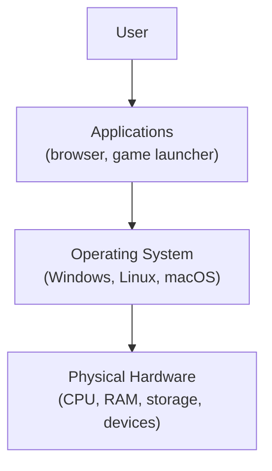
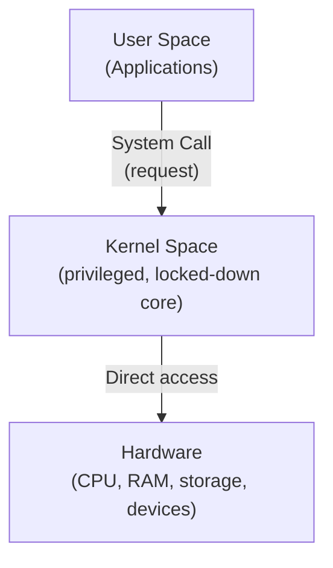

# 🖥️ What is an Operating System?

> [!info] Room Info
> **Module:** Operating Systems (builds on [[Computer Fundamentals MOC|Computer Fundamentals]])
> Goal: Understand what an OS is, its core duties, how you interact with it (GUI/CLI), and the landscape of real-world operating systems.

---

## 1. Introduction

You turn on your phone or laptop, and everything "just works" — apps launch, files open, music plays. The **operating system (OS)** is the invisible layer making that possible.

> [!quote] Scenario
> A friend gifts you their old computer — it "used to run well," but they can't remember much else. Before upgrading, wiping, selling, or repurposing it, you need to figure out exactly what you're dealing with.

### Learning Objectives
- Understand what an operating system is and the role it plays
- Explain the core duties of an operating system
- Identify common OS types and their typical use cases
- Practice interacting with an OS to gather system information

### Prerequisites
- [[Computer Fundamentals MOC|Computer Fundamentals module]]

---

## 2. What Is an Operating System?

The **OS** is the core software that coordinates everything happening on a computer. It sits between the **user**, **applications**, and the **physical hardware** — the invisible manager keeping the whole machine running as one unified system.

### The Airport Analogy

| Airport Element | Computer Equivalent |
|---|---|
| Runways, airplanes, fuel systems, radar | **Hardware** (CPU, RAM, storage, devices) |
| Airlines and passengers, trying to take off/land | **Applications** (browser, game launcher) |
| Air traffic control — scheduling, managing traffic, resolving conflicts, ensuring safety | **Operating System** |

> [!warning] Why We Need an OS
> Without an OS, every application would need **direct control** over the CPU, memory, files, devices, and security — causing constant conflicts. The OS exists to be the central organizer that prevents this chaos.

> [!question]- 🧪 Quick Quiz: What Is an OS?
> 1. In one sentence, what does an OS do?
> 2. In the airport analogy, what do applications represent?
> 3. What would happen if applications had direct, unmediated control over hardware?
>
> **Answers**
> 1. It coordinates everything on a computer, sitting between the user, applications, and hardware to keep the system running as one unified whole.
> 2. Airlines and passengers — competing for resources (takeoff/landing = CPU/hardware access).
> 3. Constant conflicts — since multiple apps would fight over the same CPU, memory, files, and devices with no central arbiter.

---

## 3. System Privilege Layers

Different parts of the system run at different **permission levels** — intentionally, to prevent conflicts and security issues.

| Layer | Who Runs Here | Access Level |
|---|---|---|
| **Kernel space** | The kernel — the part of the OS that directly manages hardware and system resources | Unrestricted access to CPU, memory, storage, all hardware |
| **User space** | Standard applications | No direct hardware access — must make a **system call** and ask the kernel to act on their behalf |

> [!tip] Airport Analogy, Zoomed In
> **Kernel space** = the control tower — a strictly secured area where only trusted air-traffic controllers (the kernel) work, with direct control over runways/radar/equipment.
> **User space** = airlines and passengers on the ground — they can't enter the tower or touch equipment directly. Instead, they **radio requests** (system calls) to the tower, which handles them safely.

> [!success] Why This Separation Matters
> One faulty app can't crash the whole system — just as no airline can operate safely without going through the tower's control.

> [!question]- 🧪 Quick Quiz: Privilege Layers
> 1. What runs in kernel space, and what access does it have?
> 2. Why can't a regular application directly play a sound or save a file to disk?
> 3. What's a "system call," in plain terms?
> 4. What's the practical security benefit of separating kernel space from user space?
>
> **Answers**
> 1. The kernel — with unrestricted access to CPU, memory, storage, and all hardware.
> 2. Applications run in user space, which is deliberately blocked from direct hardware access, for safety.
> 3. A request an application makes to the kernel, asking it to perform a privileged action (open a file, play audio, use the network) on the app's behalf.
> 4. It isolates faults — a crashing or misbehaving app in user space can't take down the whole system, since it never had direct control over the hardware in the first place.

---

## 4. Operating System Duties

Every OS handles a set of core responsibilities that keep a computer running safely, efficiently, and predictably:

| Responsibility | What the OS Does | Example |
|---|---|---|
| **Process Management** | Creates, schedules, prioritizes, and terminates running programs; decides CPU time per process | Running browser + music player + social media app without freezing |
| **Memory Management** | Allocates RAM to processes, isolates each app's memory, reclaims memory on close; uses virtual memory when RAM runs low | Multiple apps open at once, each isolated so they don't interfere or crash each other |
| **File System Management** | Organizes files into directories; handles naming, paths, permissions, metadata | Creating a folder, saving a photo, setting a file to "read only" |
| **User Management** | Handles multiple user accounts, authentication, and permissions | Logging in with a password; your files stay inaccessible to other accounts |
| **Device Management** | Loads drivers, provides a hardware abstraction layer so apps can request generic actions | Plugging in a new mouse/printer/external drive and it "just works" |

> [!question]- 🧪 Quick Quiz: OS Duties
> 1. Which OS duty is responsible for making multitasking feel seamless?
> 2. What does the OS do when RAM runs low?
> 3. Which OS duty is responsible for permissions on a saved file?
> 4. What is a "hardware abstraction layer" and which duty provides it?
> 5. Which duty ensures your files stay private from other users on a shared computer?
>
> **Answers**
> 1. Process Management.
> 2. Uses virtual memory to keep the system stable.
> 3. File System Management.
> 4. A universal interface letting apps say "print this" or "play this sound" without knowing hardware specifics — provided by Device Management.
> 5. User Management.

---

## 5. Operating System Security

Before any antivirus, firewall, or third-party security tool even exists, the OS is **already enforcing protections** in the background.

| OS Security Function | What It Does |
|---|---|
| **Authentication** | Verifies who you are — passwords, biometrics |
| **Permissions** | Controls exactly what each user/app can read, write, or execute |
| **Isolation** | Keeps every process in its own protected box (kernel/user space separation) |
| **System Protection** | Safeguards critical system files/settings from unauthorized changes |

> [!question]- 🧪 Quick Quiz: OS Security
> 1. Name the four basic security functions every OS handles.
> 2. Which of these security functions is directly tied to the kernel/user space separation covered earlier?
>
> **Answers**
> 1. Authentication, Permissions, Isolation, System Protection.
> 2. Isolation.

---

## 6. OS Interaction and Landscape

### Two Ways to Interact with an OS

| Interface | How It Works | Trade-off |
|---|---|---|
| **GUI** (Graphical User Interface) | Visual representation — icons, windows, menus. Tap/click what you want. | Easier, no memorization needed, but less precise/fast for advanced tasks |
| **CLI** (Command-Line Interface) | Type exact text-based commands to retrieve/manipulate information | Far more precision, control, and speed — but requires knowing the correct syntax |

> [!tip] Navigation App Analogy
> **GUI** ≈ tapping an icon of your destination and letting the app generate directions.
> **CLI** ≈ typing in the exact GPS coordinates yourself — direct and extremely accurate, but only if you know exactly what to type.

> [!example] Same Task, Two Interfaces
> Viewing the contents of a user's home directory: GUI requires a few clicks through File Explorer/Finder; CLI requires a single command (e.g. `ls`) to list directory contents instantly.

### The Operating System Landscape (5 Major Categories)

| OS Type | Primary Use Case | Key Characteristics |
|---|---|---|
| **Desktop** | Personal computers, daily work, gaming, content creation | Rich GUI, runs many apps at once, user-focused |
| **Server** | Web hosting, databases, cloud services, back-end | Headless (no GUI), maximum uptime, multi-user, remote access |
| **Mobile** | Smartphones and tablets | Touch-based UI, power efficient, always connected, app sandboxing |
| **Embedded** | Appliances, cars, IoT devices, smart TVs, routers | Tiny footprint, runs on limited hardware |
| **Virtual/Cloud** | Lab machines, containers, cloud instances | Lightweight, scalable, rapid deployment |

> [!question]- 🧪 Quick Quiz: Interaction & Landscape
> 1. What's the core trade-off between GUI and CLI?
> 2. Which OS type is "headless" and why does that make sense for its use case?
> 3. Which OS type prioritizes power efficiency and app sandboxing?
> 4. Which OS category would a smart TV or router fall under?
>
> **Answers**
> 1. GUI is easier and more visual but less precise/fast for advanced tasks; CLI is faster and more precise but requires knowing exact commands/syntax.
> 2. Server — it has no GUI, since it typically runs unattended and is accessed remotely, with uptime/stability prioritized over a visual interface.
> 3. Mobile.
> 4. Embedded.

---

## 7. Real-World Operating Systems (By Family)

### Desktop
| OS | Notes |
|---|---|
| **Windows** | Most widely used on personal computers — Windows 10 (EOL), Windows 11 |
| **macOS** | Apple's desktop OS — polished GUI, deep Apple device integration — Sonoma (14), Sequoia (15), Tahoe (26) |
| **Linux** | Family of open-source distributions, not a single OS — Ubuntu, Debian, Fedora |

### Server
| OS | Notes |
|---|---|
| **Windows Server** | Large networks, data centers, corporate environments — 2016, 2019, 2022, 2025 |
| **Linux** | Powers the vast majority of web servers — Ubuntu Server, Debian, CentOS, Red Hat |
| **Unix** | Large enterprises, finance, telecom, government — IBM AIX, Oracle Solaris |

### Mobile
| OS | Notes |
|---|---|
| **Android** | Most widely used mobile OS — phones, tablets, smart devices — Android 14–16 + manufacturer versions |
| **iOS** | Apple's mobile OS — iPhones, iPads — iOS 17, 18, 26 |

### Embedded & IoT
| OS | Notes |
|---|---|
| **Embedded Linux** | Specialized OS built into dedicated-function devices — OpenWrt, Ubuntu Core, Yocto Project |
| **Real-Time OS (RTOS)** | Guaranteed response times, e.g. aircraft controls — FreeRTOS, VxWorks, QNX |

### Virtual & Cloud
| OS | Notes |
|---|---|
| **Cloud/VM** | Data centers hosting websites/apps/streaming — Ubuntu LTS, Amazon Linux, Rocky Linux |
| **Container-optimized** | Lightweight, packages just the app + dependencies — Alpine Linux, Bottlerocket (AWS), Flatcar Linux |

> [!info] Ties Back to Earlier Notes
> The **Virtual/Cloud** category connects directly to [[Virtualization]] and [[Cloud Computing]] — the OS families here (Ubuntu LTS, Amazon Linux, Alpine, etc.) are the actual operating systems running *inside* the VMs/containers discussed there.

### Why So Many Operating Systems?

Different devices/environments demand different capabilities:

- **Laptops** — need to be user-friendly and support multitasking
- **Servers** — need stability, security, continuous uptime
- **Mobile devices** — need power efficiency and hardware integration for battery life
- **Embedded systems** — need lightweight OSes designed for one specialized purpose

Developers/communities behind each OS also have different goals — ease of use, performance, security, openness, or customization. **No single OS fits every situation**, so an entire ecosystem has evolved instead.

> [!question]- 🧪 Quick Quiz: Real-World OS Families
> 1. Name the three major desktop OS families.
> 2. Which Linux distributions are commonly used specifically as servers?
> 3. What kind of OS is FreeRTOS, and what's it built for?
> 4. Why is there no single "best" operating system for every situation?
> 5. What connects the Virtual/Cloud OS category to concepts from earlier notes?
>
> **Answers**
> 1. Windows, macOS, Linux.
> 2. Ubuntu Server, Debian, CentOS, Red Hat.
> 3. A Real-Time OS (RTOS) — built for applications where tasks need guaranteed response times, e.g. aircraft controls.
> 4. Because different devices/environments prioritize different things (usability, stability, power efficiency, footprint), and different OS creators optimize for different goals — no one design serves them all.
> 5. It's the operating system layer running inside the VMs and containers discussed in [[Virtualization]] and [[Cloud Computing]].

---

## 🧠 Key Takeaways
- The OS is the coordinator sitting between user, applications, and hardware — without it, apps would directly (and chaotically) fight over hardware access.
- **Kernel space** (privileged, direct hardware access) vs. **user space** (restricted, must use system calls) — this separation is what keeps one bad app from crashing the whole system.
- Five core OS duties: **Process, Memory, File System, User, and Device Management.**
- OS security starts before any antivirus/firewall: **Authentication, Permissions, Isolation, System Protection.**
- Two interaction modes: **GUI** (visual, easy, less precise) vs **CLI** (text-based, precise, faster for advanced tasks).
- Five real-world OS categories: **Desktop, Server, Mobile, Embedded, Virtual/Cloud** — each shaped by its specific use case's demands.
- No single OS wins everywhere — hence the wide real-world ecosystem (Windows, macOS, Linux, Android, iOS, RTOS, etc.).

## 📝 Full Module Recap Quiz
> [!question]- End-to-End Review (test yourself without peeking at the sections above)
> 1. Explain the airport analogy for the OS end-to-end (hardware, applications, OS).
> 2. What's the difference between kernel space and user space, and why does that separation matter for stability/security?
> 3. List all five OS duties and give one real-world example of each.
> 4. List the four basic OS security functions.
> 5. Compare GUI and CLI — what's each best suited for?
> 6. Name all five OS landscape categories and one defining characteristic of each.
> 7. Why does the real world have so many different operating systems instead of just one universal OS?

## 🔗 Related Notes
- [[Computer Fundamentals MOC]]
- [[Virtualization]]
- [[Cloud Computing]]
- [[Client-Server Basics]]
- [[Inside a Computer System]]
- [[Computer Types]]
- [[Linux Fundamentals]]
- [[Windows Fundamentals]]

## 📌 Next Steps
- [ ] Complete the hands-on task (interacting with an OS to gather system information) — this room's Task 4
- [ ] Try both GUI and CLI for the same task on your own machine (e.g. listing a folder's contents) to feel the difference firsthand
- [ ] Revisit quiz sections for spaced repetition
