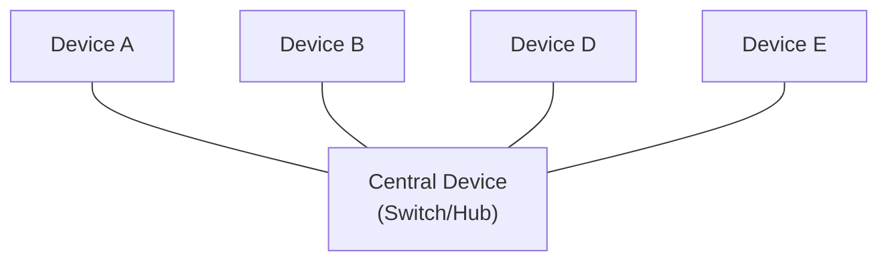
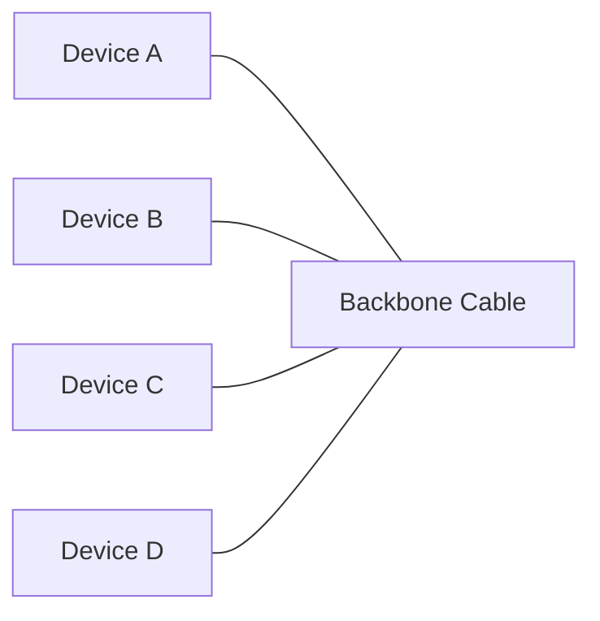
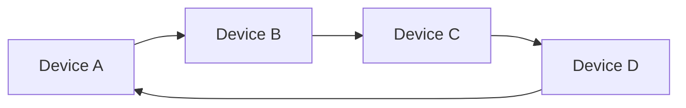
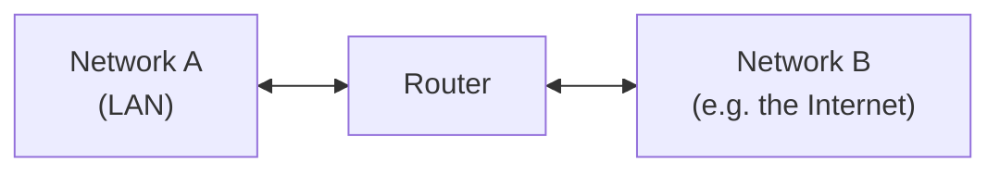

# 🖧 Intro to LAN

> [!warning] Premium Room — Partial Content
> Only **Task 1 (Introducing LAN Topologies)** is publicly accessible. Tasks 2–5 — **Subnetting**, **ARP**, **DHCP**, and **OSI Model** — are paywalled. This note covers Task 1 in full, with placeholders ready for the rest once you paste them in.

> [!info] Room Info
> **Difficulty:** Info · **Time:** ~15 min · **Module:** Networking
> Goal: Understand LAN topologies (Star, Bus, Ring) and the roles of switches and routers in a local network.

---

## 1. Introducing LAN Topologies

**Topology** = the design/layout of a network. Over the years, several designs have been experimented with and implemented, each with its own trade-offs.

### Star Topology

Devices connect individually to a **central networking device** (switch or hub). Most common topology today.

| Aspect | Detail |
|---|---|
| **Pros** | Highly **scalable** — easy to add more devices as demand grows |
| **Cons** | More expensive (extra cabling + dedicated equipment); more maintenance as it scales; harder troubleshooting at scale; if the central device fails, **all connected devices lose connectivity** |
| **Reliability** | Central hardware is usually robust, so failures are reduced — but not eliminated |

### Bus Topology

All devices connect to a single shared **backbone cable**.

| Aspect | Detail |
|---|---|
| **Pros** | Cheapest and easiest to set up — minimal cabling/equipment |
| **Cons** | Prone to **bottlenecks** when multiple devices transmit simultaneously (shared medium); troubleshooting is hard since all traffic shares one path; **single point of failure** — a broken backbone cable takes down the whole network |

### Ring Topology

Devices connect directly to each other, forming a closed **loop**. Also called **token topology**.

| Aspect | Detail |
|---|---|
| **How it works** | Data travels around the loop, passed device-to-device until it reaches its destination. A device only forwards someone else's data if it has none of its own to send — its own data takes priority |
| **Pros** | Minimal cabling, less dependent on dedicated hardware than star; data travels in one direction, making faults **easier to isolate**; **less prone to bottlenecks** than bus (no simultaneous mass traffic) |
| **Cons** | Inefficient — data may pass through many devices before reaching its destination; **one break (cable or device) can take down the entire network** |

### Comparing the Three Topologies

| Topology | Setup Cost | Scalability | Fault Tolerance | Troubleshooting |
|---|---|---|---|---|
| **Star** | High | High | Fails if central device fails | Moderate |
| **Bus** | Low | Low | Single point of failure (backbone) | Hard |
| **Ring** | Low–Moderate | Low | One break can down the whole loop | Easy (one direction) |

---

## 2. What Is a Switch?

A **switch** aggregates multiple devices (computers, printers, etc.) via Ethernet ports — commonly 4, 8, 16, 24, 32, or 64 ports. Found in larger networks: businesses, schools, similar-sized environments.

> [!tip] Switch vs. Hub
> A switch **tracks which device is on which port** — when it receives a packet, it forwards it *only* to the intended target port, rather than repeating it to every port (which is what a **hub** does). This significantly reduces unnecessary network traffic.

> [!note] Redundancy via Multiple Connections
> Switches and routers can connect to one another, and having multiple paths between them increases **redundancy** — if one path fails, another can be used. This can slightly reduce performance (longer travel time for packets) but **eliminates downtime** — a reasonable trade-off.

---

## 3. What Is a Router?

A **router**'s job is to **connect networks together and pass data between them** — a process called **routing**.

> [!tip] Routing, Defined
> Routing = the process of data traveling *across* networks, via a path created between them so the data can be successfully delivered. Especially useful when devices are connected via **multiple possible paths**.

> [!question]- 🧪 Quick Quiz: LAN Topologies, Switches & Routers
> 1. What does "topology" mean in networking?
> 2. Which topology is generally the most expensive to set up and maintain, and why is it still the most common?
> 3. Which topology is cheapest to set up, and what's its biggest weakness?
> 4. In a ring topology, under what condition will a device forward someone else's data?
> 5. What's the key functional difference between a switch and a hub?
> 6. What is "routing," in one sentence?
> 7. Why would you connect multiple switches/routers together with redundant paths, despite a potential performance cost?
>
> **Answers**
> 1. The design or layout of a network.
> 2. **Star** — expensive due to cabling and dedicated central hardware, but most common due to reliability and scalability.
> 3. **Bus** — cheapest, but has a single point of failure (the shared backbone cable) and is prone to bottlenecks.
> 4. Only if it has no data of its own to send at that moment — its own data always takes priority.
> 5. A switch sends packets only to the intended destination port (based on tracked device-port mapping); a hub repeats every packet to every port, creating more unnecessary traffic.
> 6. The process of data traveling across networks via a created path so it can be successfully delivered to its destination.
> 7. For **redundancy** — if one path fails, traffic can reroute via another, avoiding downtime even at a small performance cost.

---

## 4. A Primer on Subnetting 🔒 *(Premium — locked)*

> [!note] Placeholder
> Paste this task's content here once completed, and I'll fold it in with matching formatting and diagrams (subnetting is very visual — expect a diagram breaking down subnet masks/CIDR notation once you share it).

- [ ] Paste Task 2 content here

---

## 5. ARP 🔒 *(Premium — locked)*

> [!note] Placeholder
> **ARP (Address Resolution Protocol)** — likely covers how devices resolve an IP address to a MAC address on a local network. Paste content here once completed.

- [ ] Paste Task 3 content here

---

## 6. DHCP 🔒 *(Premium — locked)*

> [!note] Placeholder
> **DHCP (Dynamic Host Configuration Protocol)** — likely covers how devices are automatically assigned IP addresses on a network. Paste content here once completed.

- [ ] Paste Task 4 content here

---

## 7. Continue Your Learning: OSI Model 🔒 *(Premium — locked)*

> [!note] Placeholder
> Points toward the next room in the path — the **OSI Model**. Will become `[[OSI Model]]` as its own note once you get there.

---

## 🧠 Key Takeaways (from available content)
- **Topology** = the shape/design of a network. Three classic types: **Star** (central hub, scalable, costly), **Bus** (shared backbone, cheap, single point of failure), **Ring** (closed loop, easy fault isolation, but one break kills the whole network).
- **Switches** intelligently forward traffic only to the intended device's port — far more efficient than a hub's "repeat to everyone" approach.
- **Routers** connect separate networks and handle **routing** — creating paths for data to travel between them.
- Redundant connections between switches/routers trade a small performance cost for **zero downtime** during a path failure.
- *(To be expanded once Subnetting, ARP, DHCP, and OSI Model content is added.)*

## 📝 Recap Quiz (partial — based on Task 1 only)
> [!question]- Review
> 1. Name all three LAN topologies covered and one pro/con of each.
> 2. What does LAN stand for?
> 3. What's the core difference in behavior between a switch and a hub?
> 4. What verb describes what a router does, and what does it mean?

## 🔗 Related Notes
- [[What is Networking]]
- [[Client-Server Basics]]
- [[Windows CLI Basics]]
- [[Linux CLI Basics]]
- [[Networking MOC]]

## 📌 Next Steps
- [ ] Paste content for Subnetting, ARP, DHCP, and OSI Model tasks once completed to finish this note
- [ ] Sketch your own home network's topology (likely Star, via your router) as a quick real-world check
