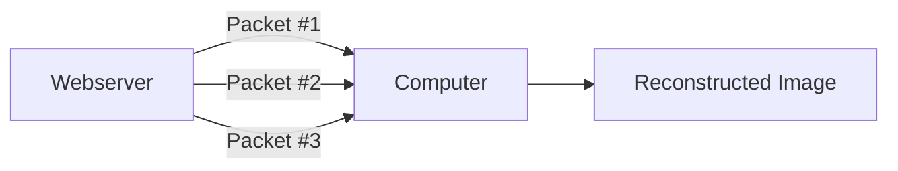
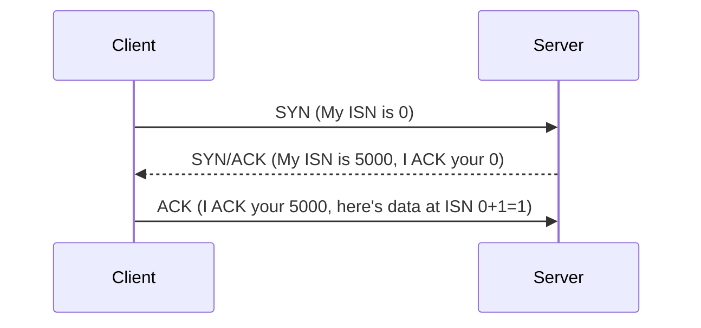
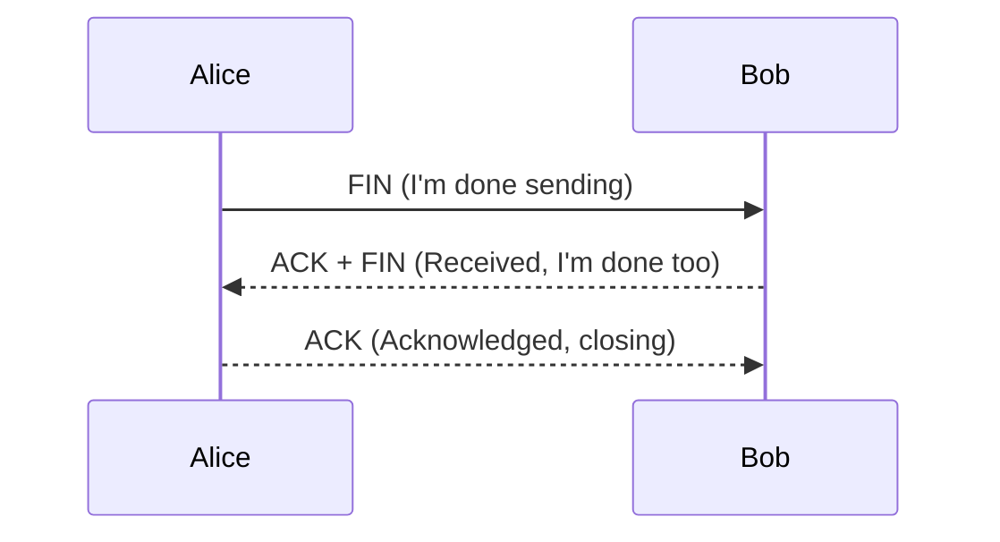
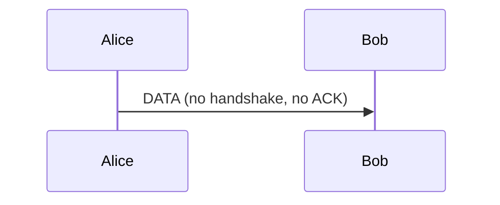

# 📦 Networking Protocols: TCP, UDP, Packets, Frames & Ports

> [!info] Room Info
> **Module:** Networking (follows [[OSI Model]])
> Goal: Understand packets vs. frames, how TCP establishes/closes connections (Three-way handshake), how UDP differs, and how ports let devices route data to the right application.

---

## 1. What Are Packets and Frames?

Both are small pieces of data that combine to form a larger message — but they belong to **different OSI layers**.

| Term | OSI Layer | Contains |
|---|---|---|
| **Packet** | Layer 3 (Network) | IP header + payload |
| **Frame** | Layer 2 (Data Link) | Encapsulates the packet + adds MAC addresses |

> [!tip] The Envelope Analogy
> Mailing a letter: the **envelope** = the **frame** — it moves the contents (the **packet**, i.e. the letter itself) to another location. Once the recipient opens the envelope (frame), they know how to forward the letter (packet) onward.

> [!note] Quick Rule of Thumb
> Talking about **IP addresses** → you're talking about **packets**. Once the encapsulating info is stripped away → you're talking about the **frame** itself.

### Why Break Data Into Packets?

Packets make data exchange **efficient** — sending small pieces reduces the chance of network bottlenecking compared to sending one giant message at once.

> [!example] Loading an Image
> A website image isn't sent as one solid file — it's divided into packets and reconstructed on your computer once all pieces arrive (same cat-picture example from [[OSI Model]]).

### Common IP Packet Headers

| Header | Description |
|---|---|
| **Time to Live (TTL)** | Sets an expiry timer so a lost packet doesn't clog the network forever |
| **Checksum** | Integrity check — if data changes in transit, the checksum won't match, revealing corruption |
| **Source Address** | The sending device's IP — so return data knows where to go |
| **Destination Address** | The receiving device's IP — so the packet knows where to travel |

> [!question]- 🧪 Quick Quiz: Packets and Frames
> 1. At which OSI layer does a packet exist? A frame?
> 2. In the envelope analogy, what represents the frame, and what represents the packet?
> 3. Why is breaking data into packets more efficient than sending one large message?
> 4. What does the TTL header prevent?
> 5. What does a checksum mismatch indicate?
>
> **Answers**
> 1. Packet = Layer 3 (Network); Frame = Layer 2 (Data Link).
> 2. The envelope = the frame; the letter inside = the packet.
> 3. It reduces the chance of network bottlenecking compared to transmitting one large message at once.
> 4. A packet endlessly circulating the network if it never reaches its destination or exits properly.
> 5. That the data was corrupted or altered in transit.

---

## 2. TCP/IP and the Three-Way Handshake

**TCP (Transmission Control Protocol)** is closely related to the OSI model — the **TCP/IP model** is essentially a summarized, 4-layer version of it:

| TCP/IP Layer | Roughly Maps To (OSI) |
|---|---|
| Application | Application, Presentation, Session |
| Transport | Transport |
| Internet | Network |
| Network Interface | Data Link, Physical |

Like the OSI model, data gains information at each layer — **encapsulation** (and the reverse, **decapsulation**).

> [!tip] TCP Is Connection-Based
> TCP must **establish a connection** between client and server *before* any data is sent. This is what guarantees delivery — via the **Three-way handshake**.

### TCP: Advantages & Disadvantages

| Advantages | Disadvantages |
|---|---|
| Guarantees data integrity | Requires a reliable connection — if one chunk is lost, the whole transfer must be re-sent |
| Synchronizes both devices, preventing data flooding/out-of-order delivery | A slow connection bottlenecks the other device — the connection stays reserved the whole time |
| Extensive reliability processes | Significantly slower than UDP due to all this extra overhead |

### TCP Packet Headers

| Header | Description |
|---|---|
| **Source Port** | Randomly chosen port (0–65535) the sender uses to send the packet |
| **Destination Port** | The specific port the target service/application listens on (e.g. a webserver on port 80) — **not** random |
| **Source IP** | Sending device's IP address |
| **Destination IP** | Receiving device's IP address |
| **Sequence Number** | Random starting number assigned to the first piece of transmitted data |
| **Acknowledgement Number** | Sequence number of the *next* expected piece of data (previous + 1) |
| **Checksum** | Gives TCP its integrity guarantee — mismatched output on the receiving end = corrupted data |
| **Data** | The actual bytes being transmitted |
| **Flag** | Controls how the packet should be handled during the handshake process |

### The Three-Way Handshake — Messages

| Step | Message | Description |
|---|---|---|
| 1 | **SYN** | Client's initial packet — initiates and attempts to synchronize the connection |
| 2 | **SYN/ACK** | Server acknowledges the client's synchronization attempt |
| 3 | **ACK** | Either side can use this to confirm successful receipt of messages |
| 4 | **DATA** | Actual data (e.g. file bytes) sent once the connection is established |
| 5 | **FIN** | Cleanly closes the connection once complete |
| — | **RST** | Abruptly terminates communication — last resort, signals something went wrong (e.g. broken service, low resources) |

### The Handshake, Step by Step

> [!tip] Sequence Numbers, Explained
> Each side proposes an **Initial Sequence Number (ISN)** — a random starting point. Both sides must agree on the same numbering so data can be reassembled in the correct order. Each subsequent piece of data increments the number by 1.

| Device | Initial Sequence Number | Final Sequence Number |
|---|---|---|
| Client (Sender) | 0 | 0 + 1 = 1 |
| Client (Sender) | 1 | 1 + 1 = 2 |
| Client (Sender) | 2 | 2 + 1 = 3 |

### Closing a TCP Connection

TCP closes a connection once a device confirms the other has received all the data. Since TCP **reserves system resources** for the duration of a connection, it's best practice to close connections **as soon as possible**.

> [!question]- 🧪 Quick Quiz: TCP & the Three-Way Handshake
> 1. Why must TCP establish a connection before sending data?
> 2. List the 3 steps of the Three-way handshake in order, with their message names.
> 3. What's the difference between a Sequence Number and an Acknowledgement Number?
> 4. What does the Checksum header actually verify?
> 5. What's the difference between a FIN and an RST packet?
> 6. Why is it best practice to close TCP connections quickly?
>
> **Answers**
> 1. Because TCP is connection-based — the guarantee of delivery depends on both sides being synchronized before data transfer begins.
> 2. 1) SYN (client initiates), 2) SYN/ACK (server acknowledges + proposes its own ISN), 3) ACK (client acknowledges server's ISN and begins sending data).
> 3. The Sequence Number marks a given piece of data's position; the Acknowledgement Number is the *next expected* sequence number (previous + 1) — confirming what's already been received.
> 4. Data integrity — whether the received data matches exactly what was sent (no corruption).
> 5. FIN cleanly and properly closes a completed connection; RST abruptly terminates it, signaling a problem occurred.
> 6. TCP reserves system resources for the duration of an open connection — closing promptly frees those resources up.

---

## 3. UDP/IP

**UDP (User Datagram Protocol)** is **stateless** — no persistent connection is required. No Three-way handshake, no synchronization between devices.

> [!tip] When UDP Makes Sense
> Used where applications can tolerate lost data (video streaming, voice chat) or where a fully stable connection isn't critical. (Full comparison already covered in [[OSI Model]].)

### UDP: Advantages & Disadvantages

| Advantages | Disadvantages |
|---|---|
| Much faster than TCP | Doesn't care whether data is actually received |
| Leaves the application layer in control of packet-sending speed — flexible for developers | Unstable connections lead to a poor user experience |
| No continuous connection reserved on the device | No safeguards like TCP's data integrity checks |

### UDP Packet Headers (Simpler Than TCP)

| Header | Description |
|---|---|
| **Time to Live (TTL)** | Expiry timer, same purpose as in IP packets |
| **Source Address** | Sending device's IP |
| **Destination Address** | Receiving device's IP |
| **Source Port** | Randomly chosen sending port |
| **Destination Port** | Fixed port the target service listens on |
| **Data** | The actual transmitted bytes |

> [!note] No Acknowledgement, No Handshake
> UDP is stateless — no acknowledgement messages, no setup process. Data is simply sent, with no regard for whether it's received.

> [!question]- 🧪 Quick Quiz: UDP/IP
> 1. What makes UDP "stateless"?
> 2. Name two scenarios where UDP's unreliability is an acceptable trade-off.
> 3. Compare TCP and UDP headers — what's missing from UDP that TCP has?
> 4. Does UDP perform a handshake before sending data?
>
> **Answers**
> 1. It doesn't establish or maintain a persistent connection — no handshake, no synchronization, no acknowledgements.
> 2. Video streaming, voice chat (any case where occasional data loss is tolerable and speed matters more than perfection).
> 3. UDP lacks Sequence Numbers, Acknowledgement Numbers, Checksums, and Flags — the fields that give TCP its reliability guarantees.
> 4. No — it sends data directly with no setup process.

---

## 4. Ports

**Ports** are the specific points through which data is exchanged on a device — numerical values from **0 to 65535**.

> [!tip] The Harbour Analogy
> Ships (data) must dock at a **compatible port** at a harbour (device) — a cruise liner can't dock at a fishing-boat port and vice versa. Ports enforce **what can connect and where**, preventing chaos as data flows in and out of a device.

### Why Standardize Ports?

With **0–65535** possible ports, it'd be chaos to track what's using what — so standard rules exist. Example: **all web browsers** send data over **port 80** by convention, so any browser can interpret web data the same way, regardless of who built it.

> [!note] Common Ports (0–1024)
> Any port between **0 and 1024** is considered a "common" (well-known) port, reserved by convention for specific protocols.

### Well-Known Protocol Ports

| Protocol | Port | Description |
|---|---|---|
| **FTP** (File Transfer Protocol) | 21 | Client-server file sharing — download from a central location |
| **SSH** (Secure Shell) | 22 | Secure text-based remote login for system management |
| **HTTP** (HyperText Transfer Protocol) | 80 | Powers the World Wide Web — browsers use this to fetch text/images/video |
| **HTTPS** (HTTP Secure) | 443 | Same as HTTP, but encrypted |
| **SMB** (Server Message Block) | 445 | Like FTP, but also shares devices (e.g. printers) |
| **RDP** (Remote Desktop Protocol) | 3389 | Secure remote login via a full visual desktop interface (vs. SSH's text-only) |

> [!warning] Standards Aren't Enforced by Law
> These are **conventions**, not hard rules — you *can* run a webserver on a non-standard port (e.g. `8080` instead of `80`). But since applications assume the standard port unless told otherwise, you'll need to explicitly specify it with a colon, e.g. `example.com:8080`.

> [!question]- 🧪 Quick Quiz: Ports
> 1. What's the numerical range for a port number?
> 2. In the harbour analogy, what do ports enforce?
> 3. Why is it useful that all web browsers agree to use port 80 by convention?
> 4. What range is considered "common" or well-known ports?
> 5. Match each to its default port: FTP, SSH, HTTP, HTTPS, SMB, RDP.
> 6. If a webserver runs on port 8080 instead of 80, how would you specify that in a URL?
>
> **Answers**
> 1. 0 to 65535.
> 2. What type of data/connection can "dock" (connect) at that specific point — compatibility rules for communication.
> 3. It means any browser, regardless of manufacturer, can consistently locate and interpret web traffic — a shared, predictable rule across all implementations.
> 4. 0–1024.
> 5. FTP = 21, SSH = 22, HTTP = 80, HTTPS = 443, SMB = 445, RDP = 3389.
> 6. With a colon followed by the port number, e.g. `example.com:8080`.

---

## 🧠 Key Takeaways
- **Packet** = Layer 3 unit (IP header + payload). **Frame** = Layer 2 unit (packet + MAC addressing) — think envelope (frame) containing a letter (packet).
- **TCP** = reliable, connection-based, guarantees delivery via the **Three-way handshake** (SYN → SYN/ACK → ACK), closes cleanly via **FIN**, aborts abruptly via **RST**.
- **UDP** = stateless, no handshake, no guarantees — faster, but unreliable; good for streaming/real-time data.
- **Ports** (0–65535) direct data to the correct application on a device; **0–1024** are standardized "common" ports (HTTP=80, HTTPS=443, SSH=22, FTP=21, SMB=445, RDP=3389).
- Non-standard ports work fine technically, but require explicit specification (`:port`) since standard-port assumptions are baked into most software.

## 📝 Full Module Recap Quiz
> [!question]- End-to-End Review (test yourself without peeking at the sections above)
> 1. Explain the difference between a packet and a frame using the envelope analogy.
> 2. Walk through the full Three-way handshake and connection-closing process step by step.
> 3. Compare TCP and UDP across connection setup, reliability, speed, and typical use cases.
> 4. What are ports, and why are they numbered 0–65535?
> 5. List all six well-known protocol-port pairs covered in this note.
> 6. Why would a security professional care about which ports are open/standard on a target system?

## 🔗 Related Notes
- [[OSI Model]]
- [[What is Networking]]
- [[Intro to LAN]]
- [[Client-Server Basics]]
- [[Networking MOC]]

## 📌 Next Steps
- [ ] Use a tool like Wireshark (future room, likely) to observe a real TCP handshake in action
- [ ] Check which ports are open on your own machine/router and match them against the common ports table
- [ ] Revisit quiz sections for spaced repetition
