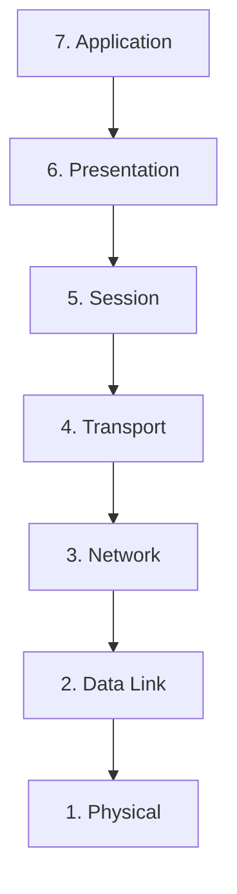
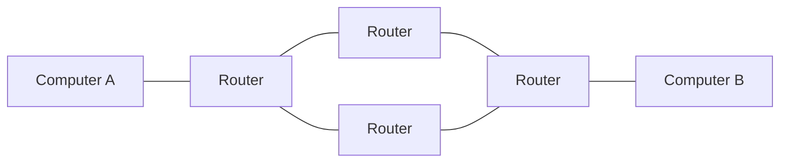
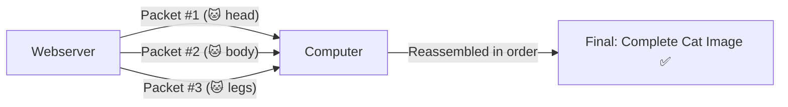
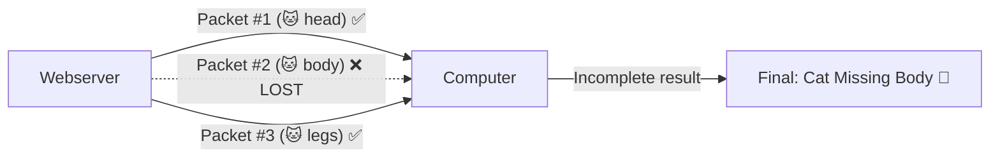

# 📶 The OSI Model

> [!info] Room Info
> **Module:** Networking
> Goal: Understand the 7-layer OSI Model — how data is packaged, addressed, routed, and interpreted as it travels across a network — plus the difference between TCP and UDP at the Transport layer.

---

## 1. What Is the OSI Model?

The **OSI Model** (Open Systems Interconnection Model) is a framework dictating how all networked devices send, receive, and interpret data.

> [!success] Why It Matters
> Devices can have completely different functions and designs, yet still communicate — because they all follow the same layered structure. Data that follows OSI's uniformity can be understood by any compliant device, regardless of manufacturer or software.

The model has **7 layers**, numbered **7 (top) → 1 (bottom)**. As data travels through each layer, specific processes occur and information gets added — this process is called **encapsulation**.

| # | Layer | One-Line Role |
|---|---|---|
| 7 | **Application** | Where users/software actually interact with data |
| 6 | **Presentation** | Translates/formats data between systems |
| 5 | **Session** | Creates and maintains the connection |
| 4 | **Transport** | Decides reliability method: TCP or UDP |
| 3 | **Network** | Routing — determines the path data takes (IP addresses) |
| 2 | **Data Link** | Physical addressing (MAC addresses) |
| 1 | **Physical** | The actual hardware/cabling transmitting raw bits |

> [!question]- 🧪 Quick Quiz: OSI Model Overview
> 1. What does OSI stand for?
> 2. Why is it useful for the OSI model to be a shared standard across different devices/vendors?
> 3. What's the term for the process of adding information to data as it passes through each layer?
> 4. In which direction are OSI layers numbered — top to bottom or bottom to top for Layer 7?
>
> **Answers**
> 1. Open Systems Interconnection.
> 2. It allows devices with completely different designs/functions to still understand each other's data, since they all follow the same layered structure.
> 3. Encapsulation.
> 4. Layer 7 (Application) is at the top; Layer 1 (Physical) is at the bottom.

---

## 2. Layer 1 — Physical

The simplest layer to grasp — it references the **physical components of hardware** used in networking, the lowest layer of the model.

> [!tip] What Happens Here
> Devices use **electrical signals** to transfer data between each other in **binary** (1s and 0s).

**Example:** Ethernet cables physically connecting devices.

---

## 3. Layer 2 — Data Link

Focuses on **physical addressing** of the transmission.

- Receives a packet from the Network layer (which includes the destination's **IP address**)
- Adds the physical **MAC (Media Access Control)** address of the receiving endpoint
- Every network-enabled computer has a **NIC (Network Interface Card)** with a unique MAC address

> [!warning] MAC Addresses Are "Burnt In" — But Spoofable
> MAC addresses are set by the manufacturer and physically burnt into the card — they can't be *changed*, but they **can be spoofed** (faked). When data is sent, it's the physical (MAC) address that's actually used to identify exactly where to deliver it.

The Data Link layer also formats the data appropriately for transmission.

> [!question]- 🧪 Quick Quiz: Physical & Data Link Layers
> 1. What form does data take at the Physical layer?
> 2. What does the Data Link layer add to a packet it receives from the Network layer?
> 3. What is a NIC, and what's unique about it?
> 4. Can a MAC address be legitimately changed by the user? Can it be spoofed?
>
> **Answers**
> 1. Electrical signals representing binary (1s and 0s).
> 2. The physical MAC address of the receiving endpoint.
> 3. Network Interface Card — the hardware component inside every network-enabled device, carrying a unique MAC address.
> 4. It can't be legitimately changed (it's burnt in by the manufacturer), but it **can** be spoofed/faked.

---

## 4. Layer 3 — Network

Where **routing** and **re-assembly** of data happens — small chunks are routed individually, then reassembled into the larger whole at the destination.

> [!tip] Routing = Finding the Optimal Path
> Routing determines the *most optimal path* for data chunks to travel. Some routing protocols — **OSPF** (Open Shortest Path First) and **RIP** (Routing Information Protocol) — decide this; at this stage, just know they exist.

**Factors deciding the optimal path:**
- **Shortest path** — fewest devices the packet needs to cross
- **Most reliable path** — has this path lost packets before?
- **Fastest physical connection** — copper (slower) vs. fibre (considerably faster)

> [!note] IP Addresses & Layer 3 Devices
> Everything at this layer is handled via **IP addresses** (e.g. `192.168.1.100`). Devices capable of delivering packets using IP addresses — like **routers** — are called **Layer 3 devices**, since they operate at this layer of the model.

> [!question]- 🧪 Quick Quiz: Network Layer
> 1. What two things happen at the Network layer?
> 2. Name the two routing protocols mentioned, and what they stand for.
> 3. List the three factors that decide the "optimal" path for data.
> 4. Why are routers called "Layer 3 devices"?
>
> **Answers**
> 1. Routing (determining the path) and re-assembly (putting the chunked data back together).
> 2. OSPF (Open Shortest Path First) and RIP (Routing Information Protocol).
> 3. Shortest path, most reliable path, fastest physical connection type.
> 4. Because they operate using IP addresses to deliver packets — the defining function of Layer 3 (Network) in the OSI model.

---

## 5. Layer 4 — Transport (TCP vs. UDP)

When data is sent between devices, it follows one of two protocols, chosen based on several factors:

### TCP (Transmission Control Protocol)

Designed for **reliability and guarantee**. Reserves a constant connection between two devices for the duration of the transfer, and includes **error checking** — guaranteeing that small chunks of data sent from the Session layer are received and reassembled **in the correct order**.

| Advantages of TCP | Disadvantages of TCP |
|---|---|
| Guarantees accuracy of data | Requires a reliable connection — if one chunk isn't received, the whole chunk of data becomes unusable |
| Synchronizes both devices to prevent either from being flooded with data | A slow connection bottlenecks the other device, since the connection stays reserved the whole time |
| Performs extensive processes for reliability | Significantly **slower** than UDP due to all this extra work |

**Used for:** file sharing, internet browsing, sending email — anywhere data must be **accurate and complete**.

> [!example] The Cat Picture Analogy
> A picture of a cat is broken into small packets by the webserver. With **TCP**, the computer receives and reassembles *all* packets in the correct order — resulting in the complete, correct image.

### UDP (User Datagram Protocol)

Much simpler than TCP — no error checking, no reliability guarantees, no synchronization. Data is sent whether or not it actually arrives — "hope for the best."

| Advantages of UDP | Disadvantages of UDP |
|---|---|
| Much **faster** than TCP | Doesn't care if data is actually received |
| Leaves the application layer in control of packet-sending speed — flexible for developers | Unstable connections lead to a poor user experience |
| Doesn't reserve a continuous connection like TCP does | Missing data is simply... missing |

**Used for:** small data exchanges (e.g. **ARP** and **DHCP** — covered in [[Intro to LAN]]) or large data streams where some loss is tolerable, like **video streaming** (a few lost packets = a few pixelated frames, not a broken stream).

> [!example] The Cat Picture Analogy, UDP Version
> Using the same example: only Packets #1 and #3 arrive. With **UDP**, there's no mechanism to notice or recover the missing Packet #2 — the computer ends up with an incomplete, broken image.

### TCP vs. UDP — Side by Side

| | TCP | UDP |
|---|---|---|
| **Reliability** | Guaranteed delivery, ordered | No guarantee |
| **Speed** | Slower | Faster |
| **Connection** | Persistent, reserved | None reserved |
| **Error checking** | Yes | No |
| **Best for** | Files, browsing, email | Streaming, device discovery (ARP/DHCP), real-time data |

> [!question]- 🧪 Quick Quiz: Transport Layer (TCP vs. UDP)
> 1. What does TCP guarantee that UDP does not?
> 2. Why is TCP slower than UDP?
> 3. Give two real-world use cases for TCP and two for UDP.
> 4. In the cat-picture analogy, what happens differently between the TCP and UDP versions when a packet is lost?
> 5. Why is UDP an acceptable choice for video streaming, despite its unreliability?
>
> **Answers**
> 1. That all data arrives, in the correct order, error-checked and complete.
> 2. It performs constant error checking, connection synchronization, and reserves a continuous connection — all extra overhead UDP skips.
> 3. TCP: file sharing, internet browsing, email. UDP: video streaming, device discovery protocols like ARP/DHCP.
> 4. TCP would essentially not consider the transfer complete/usable until all chunks arrive correctly; UDP just delivers what arrives, resulting in an incomplete/corrupted result with no recovery mechanism.
> 5. Because a lost packet just causes minor, tolerable pixelation for a moment — not worth the overhead and delay TCP's guarantees would introduce for real-time playback.

---

## 6. Layer 5 — Session

Once data is correctly translated/formatted by the Presentation layer, the **Session layer** creates and maintains the connection to the destination computer.

- **Session created** = when a connection is established
- **Session active** = as long as the connection is active
- **Session layer also handles closing** the connection — if it's unused for a while, or lost

> [!tip] Checkpoints
> A session *can* contain **checkpoints** — if data is lost, only the *newest* pieces need to be resent, saving bandwidth (rather than restarting the whole transfer).

> [!note] Sessions Are Unique
> Data cannot travel across different sessions — only within the specific session it belongs to.

---

## 7. Layer 6 — Presentation

The layer where **standardization** happens. Different software developers build things differently (e.g. different email clients) — but data still needs to be handled consistently regardless of the specific software.

> [!tip] Acts as a Translator
> This layer translates data to/from the Application layer (Layer 7). The receiving computer understands data sent in one format even if it's destined for a different format on its end.
>
> **Example:** You send an email from one client; the recipient uses a completely different email client — but the email's content still displays correctly.

> [!warning] Security Lives Here Too
> Features like **data encryption** (e.g. HTTPS when visiting a secure site) occur at this layer.

---

## 8. Layer 7 — Application

The layer you're **most familiar with** — where protocols/rules exist to determine how the *user* interacts with sent/received data.

**Examples:**
- Everyday apps — email clients, browsers, file transfer software (e.g. FileZilla) — provide a friendly **GUI** for interacting with data
- **DNS** (Domain Name System) — translates website addresses into IP addresses — also operates at this layer

> [!example] Real Example
> Browsing an FTP index (e.g. `ftp://tbfc.net`) via a browser — the browser (Application layer software) presents raw file/folder listings in a usable, navigable format for the user.

> [!question]- 🧪 Quick Quiz: Session, Presentation & Application Layers
> 1. What triggers the creation of a session, and what can end one?
> 2. What's the benefit of "checkpoints" within a session?
> 3. What's the main job of the Presentation layer?
> 4. Give an example of a security feature that operates at the Presentation layer.
> 5. What kind of protocols/software live at the Application layer? Give two examples.
> 6. What does DNS do, and at which layer does it operate?
>
> **Answers**
> 1. A session is created when a connection is established; it can end if the connection goes unused for a while or is lost.
> 2. If data is lost, only the newest pieces need to be resent — saving bandwidth instead of restarting the whole transfer.
> 3. Acting as a translator — standardizing/formatting data between the Application layer and the rest of the model, so different software can still interoperate.
> 4. Data encryption, e.g. HTTPS.
> 5. User-facing protocols/software providing a GUI or defined rules for interacting with data — e.g. email clients, web browsers, FTP clients (FileZilla), DNS.
> 6. DNS translates website addresses (domain names) into IP addresses; it operates at the Application layer (Layer 7).

---

## 🧠 Key Takeaways — Full OSI Stack Summary

| # | Layer | Key Function | Example / Key Term |
|---|---|---|---|
| 7 | **Application** | User-facing rules/protocols for interacting with data | Browsers, email clients, DNS |
| 6 | **Presentation** | Translates/standardizes data between systems | Encryption (HTTPS) |
| 5 | **Session** | Creates/maintains/closes the connection | Checkpoints, unique sessions |
| 4 | **Transport** | Chooses reliability method | TCP (reliable) vs. UDP (fast) |
| 3 | **Network** | Routing between networks | IP addresses, routers (Layer 3 devices) |
| 2 | **Data Link** | Physical addressing | MAC addresses, NIC |
| 1 | **Physical** | Raw electrical signal transmission | Ethernet cables, binary |

- Data moves **down** the stack when sending (7→1) and **up** the stack when receiving (1→7), gaining/losing layer-specific info at each step — this is **encapsulation** (and its reverse, **decapsulation**).
- **TCP** = reliable but slower (used where correctness matters). **UDP** = fast but unreliable (used where speed matters more than perfection).
- Routers = Layer 3. Switches (from [[Intro to LAN]]) = Layer 2. This ties directly back to earlier networking notes.

## 📝 Full Module Recap Quiz
> [!question]- End-to-End Review (test yourself without peeking at the sections above)
> 1. List all 7 OSI layers in order (top to bottom) and one key responsibility of each.
> 2. What is encapsulation?
> 3. Compare TCP and UDP across reliability, speed, and typical use case.
> 4. Why are routers considered "Layer 3 devices" and switches typically associated with Layer 2?
> 5. Explain what a "session" is and why sessions are described as unique.
> 6. What layer handles encryption, and give a real-world example of it in action.
> 7. Trace a cat image download through the model: which layers matter most for getting it there correctly, and why?

## 🔗 Related Notes
- [[What is Networking]]
- [[Intro to LAN]]
- [[Client-Server Basics]]
- [[Networking MOC]]

## 📌 Next Steps
- [ ] Use browser DevTools (from [[Client-Server Basics]]) to inspect a real request and try mapping what you see to OSI layers
- [ ] Compare a file download (TCP) vs. a video call (likely UDP) and notice the difference in behavior when your connection is unstable
- [ ] Revisit quiz sections for spaced repetition
