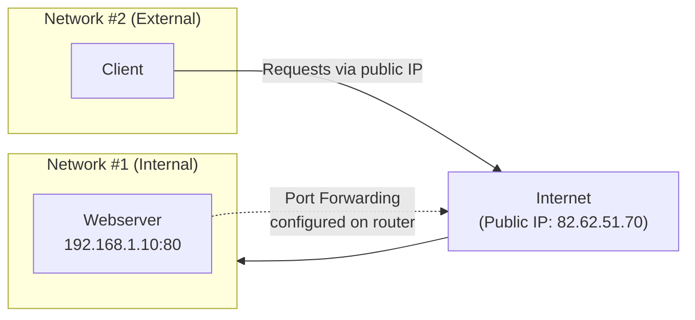
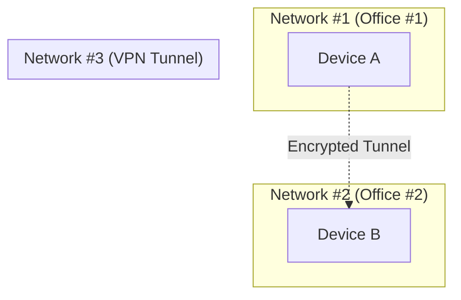
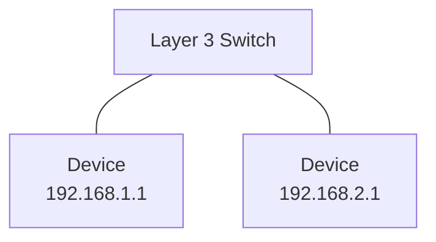
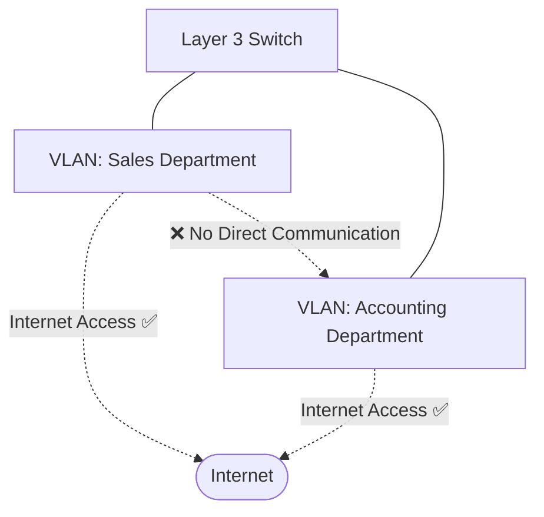

# 🔀 Port Forwarding, Firewalls, VPNs & LAN Devices

> [!info] Room Info
> **Module:** Networking (follows [[Networking Protocols - TCP UDP Packets Frames Ports]])
> Goal: Understand port forwarding, how firewalls filter traffic, what VPNs do and the tech behind them, and the roles of routers/switches (including Layer 3 switches and VLANs).

---

## 1. Introduction to Port Forwarding

Without port forwarding, services like web servers are only reachable by devices on the **same direct network** (an **intranet**).

> [!example] The Problem
> A server at `192.168.1.10` runs a webserver on port 80. Only other devices on that *same* local network can reach it.

**Port forwarding** opens up a specific port so devices *outside* the local network — via the Internet — can reach a service running inside it.

> [!warning] Not the Same as a Firewall
> **Port forwarding** *opens* a specific port so traffic can reach it. A **firewall** then decides whether traffic through that (already open) port is actually *allowed*. They work together but do different jobs — don't confuse the two.

> [!note] Where It's Configured
> Port forwarding is set up at the **router** of a network.

> [!question]- 🧪 Quick Quiz: Port Forwarding
> 1. Without port forwarding, who can access a service running on a local server?
> 2. What does port forwarding actually change, technically?
> 3. What's the key distinction between port forwarding and a firewall?
> 4. Where is port forwarding configured?
>
> **Answers**
> 1. Only other devices on the same local network (intranet).
> 2. It opens a specific port so that external (Internet) traffic can reach a service running on the internal network, via the router's public IP.
> 3. Port forwarding *opens* a port; a firewall decides whether traffic through that port is *allowed* — they're complementary, not the same mechanism.
> 4. At the router.

---

## 2. Firewalls 101

A **firewall** determines what traffic is allowed to enter/exit a network — essentially, **border security** for the network.

### Decision Factors
An administrator configures rules based on:
- **Source** — where is the traffic coming from?
- **Destination** — where is it going?
- **Port** — which port is it destined for?
- **Protocol** — is it TCP, UDP, or both?

Firewalls answer these questions via **packet inspection**.

### Firewall Forms
Firewalls range from dedicated hardware (large business networks) to residential routers, to software (e.g. **Snort**). They can be grouped into 2–5 categories; this room covers the two primary ones.

### Stateful vs. Stateless Firewalls

| Type | How It Decides | Resource Use | Behavior |
|---|---|---|---|
| **Stateful** | Looks at the **entire connection**, not just individual packets — dynamic decision-making | Higher (more resource-intensive) | If a connection from a host goes bad, it can block the **entire device** |
| **Stateless** | Uses a **static rule set** to judge each packet **individually** | Lower | A bad packet doesn't necessarily block the whole device — but rules must match *exactly* or they're useless |

> [!tip] When Each Shines
> **Stateful** = smarter, tracks whole conversations (e.g. can catch a TCP handshake that starts fine but later fails). **Stateless** = "dumber" but efficient — great for absorbing huge traffic volumes, like during a **DDoS attack**, where fine-grained per-connection tracking would be too expensive.

> [!question]- 🧪 Quick Quiz: Firewalls
> 1. List the four factors a firewall typically uses to decide whether to allow/deny traffic.
> 2. What technique do firewalls use to answer those questions?
> 3. What's the core difference between stateful and stateless firewalls?
> 4. Why might a stateless firewall be preferred during a DDoS attack, despite being "dumber"?
> 5. What happens if a stateful firewall detects a bad connection from a host? What about a stateless firewall detecting one bad packet?
>
> **Answers**
> 1. Source, destination, port, protocol.
> 2. Packet inspection.
> 3. Stateful evaluates the entire connection dynamically (resource-heavy, smarter); stateless evaluates each packet against static rules independently (lightweight, less nuanced).
> 4. It uses far fewer resources — critical when facing a massive volume of traffic where per-connection tracking would overwhelm the system.
> 5. Stateful firewalls can block the entire device; stateless firewalls generally just reject the individual bad packet, not necessarily the whole device.

---

## 3. VPN Basics

A **VPN (Virtual Private Network)** lets devices on separate networks communicate securely by creating a dedicated encrypted path (a **tunnel**) over the Internet. Devices connected via this tunnel form their own private network.

> [!example] Two Offices, One VPN
> Devices in Office #1 and Office #2 are normally isolated from each other. A VPN connects specific devices from each into a new, shared **private network (Network #3)** — while those devices remain part of their original networks too.

### Benefits of a VPN

| Benefit | Explanation |
|---|---|
| **Connects geographically distant networks** | E.g. a business with multiple offices can access shared resources (servers/infrastructure) across locations |
| **Privacy** | Encryption means only sender/recipient can read the data — protects against sniffing, especially valuable on unencrypted public Wi-Fi |
| **Anonymity** | Hides traffic from your ISP and intermediaries — critical for journalists/activists in countries with restricted free speech |

> [!warning] Anonymity Has Limits
> A VPN's anonymity is only as strong as the provider's own privacy practices. **A VPN that logs everything you do is functionally the same as not using a VPN** for anonymity purposes.

> [!note] How TryHackMe Uses VPNs
> TryHackMe uses a VPN to connect you to vulnerable lab machines without exposing them directly to the Internet:
> - You interact securely with lab machines
> - ISPs don't misinterpret your traffic as an actual attack on a public target (which could violate their terms of service)
> - Vulnerable machines stay protected from general Internet exposure

### VPN Technologies

| Technology | Description |
|---|---|
| **PPP** (Point-to-Point Protocol) | Used by PPTP for authentication + encryption; relies on matching private key + public certificate (similar concept to SSH); **not routable** on its own — can't leave a network by itself |
| **PPTP** (Point-to-Point Tunneling Protocol) | Lets PPP data actually leave the network; easy to set up, widely supported, but **weakly encrypted** compared to alternatives |
| **IPSec** (Internet Protocol Security) | Encrypts data using the existing IP framework; harder to set up, but offers **strong encryption** and broad device support |

> [!question]- 🧪 Quick Quiz: VPN Basics
> 1. What does a VPN fundamentally create between two devices/networks?
> 2. Why might a business with multiple offices benefit from a VPN?
> 3. Why is a VPN especially useful on public Wi-Fi?
> 4. What's the catch with VPN-provided anonymity?
> 5. Give one specific reason TryHackMe itself uses a VPN.
> 6. Compare PPTP and IPSec in terms of setup difficulty and encryption strength.
>
> **Answers**
> 1. An encrypted tunnel forming a private, secure connection over the (otherwise public) Internet.
> 2. It lets separate office networks securely share resources (servers, infrastructure) as if on one network.
> 3. Public Wi-Fi typically has no built-in encryption; a VPN encrypts your traffic so it can't be sniffed by others on the same network.
> 4. It's only as trustworthy as the VPN provider — a provider that logs your activity undermines the anonymity entirely.
> 5. It avoids exposing vulnerable lab machines directly to the Internet, and prevents ISPs from flagging your traffic as an actual attack.
> 6. PPTP is easier to set up and widely supported but weakly encrypted; IPSec is harder to configure but offers much stronger encryption.

---

## 4. LAN Networking Devices

### Routers (Recap + Expansion)

A **router**'s job is to connect networks and pass data between them — **routing**. Routers operate at **Layer 3** of the OSI model.

> [!tip] Administration
> Routers often have an interactive interface (web UI or console) letting an admin configure **port forwarding** and **firewall** rules — tying this whole note together.

Routing factors (recap from [[OSI Model]]): shortest path, most reliable path, fastest medium (copper vs. fibre).

> [!note] Routers ≠ Switches
> Routers are dedicated devices with different functions from switches — don't conflate the two, even though both are core LAN hardware.

### Switches

A **switch** connects multiple devices (typically 3–63) via Ethernet. Switches can operate at **Layer 2 or Layer 3** — but a given switch is exclusively one or the other (a Layer 2 switch cannot also function as Layer 3).

#### Layer 2 Switches
Forward **frames** (recall: packets encapsulated with MAC addressing) to the correct connected device based on **MAC address**. That's their sole job — frame delivery within the local network.

#### Layer 3 Switches
More sophisticated — do everything a Layer 2 switch does (forward frames via MAC), **plus** route packets between devices using **IP addresses**, like a router would.

> [!success] Layer 3 Switches Blend Roles
> They combine Layer 2's frame-forwarding with Layer 3's IP-based routing — effectively acting as a hybrid switch/router for traffic that needs to cross between different IP subnets on the same physical hardware.

### VLANs (Virtual Local Area Networks)

**VLAN** technology lets specific devices on a network be **virtually segmented** — they share infrastructure (like the same physical switch and Internet connection) but are treated as logically separate networks.

> [!example] Why This Matters — Security Through Segmentation
> "Sales" and "Accounting" departments both connect to the **same physical switch** and both get **Internet access** — but VLAN rules prevent them from communicating with **each other** directly. This segmentation is a genuine security control: it limits what a compromised device in one department can reach in another.

> [!question]- 🧪 Quick Quiz: LAN Networking Devices
> 1. At which OSI layer do routers operate?
> 2. What's the key difference between a Layer 2 switch and a Layer 3 switch?
> 3. Can a single switch operate as both Layer 2 and Layer 3 simultaneously?
> 4. What does a Layer 2 switch use to decide where to forward a frame?
> 5. What is a VLAN, and what security benefit does it provide?
> 6. In the Sales/Accounting example, what can each department do, and what are they blocked from doing?
>
> **Answers**
> 1. Layer 3 (Network).
> 2. Layer 2 only forwards frames via MAC address; Layer 3 does that *plus* routes packets between devices using IP addresses.
> 3. No — a switch operates exclusively as one or the other, not both at once.
> 4. The destination device's MAC address.
> 5. A VLAN virtually segments devices on shared physical infrastructure into logically separate networks — the security benefit is limiting communication between segments, containing potential compromise/lateral movement.
> 6. Both can access the Internet; neither can directly communicate with the other, despite being on the same physical switch.

---

## 🧠 Key Takeaways
- **Port forwarding** opens a specific port so external traffic can reach an internal service — configured at the router. It's distinct from a firewall, which decides if that traffic is *allowed*.
- **Firewalls** = network border security. **Stateful** = tracks whole connections (smarter, resource-heavy). **Stateless** = evaluates packets individually against static rules (lighter, better against high-volume attacks like DDoS).
- **VPNs** create encrypted tunnels between devices/networks — enabling secure inter-office connectivity, privacy (encryption), and (limited, provider-dependent) anonymity. Key technologies: PPP (non-routable, needs PPTP), PPTP (easy, weak encryption), IPSec (harder, strong encryption).
- **Routers** = Layer 3, connect separate networks. **Switches** = connect multiple devices on one network; Layer 2 switches forward by MAC, Layer 3 switches also route by IP.
- **VLANs** logically segment a physical network for security — shared infrastructure, isolated communication.

## 📝 Full Module Recap Quiz
> [!question]- End-to-End Review (test yourself without peeking at the sections above)
> 1. Explain the relationship (and difference) between port forwarding and firewalls.
> 2. Compare stateful and stateless firewalls across decision-making, resource use, and ideal use case.
> 3. What is a VPN tunnel, and list its three main benefits.
> 4. Compare PPTP and IPSec.
> 5. What's the difference between a router, a Layer 2 switch, and a Layer 3 switch?
> 6. Explain how a VLAN provides security even though devices share the same physical switch.

## 🔗 Related Notes
- [[Networking Protocols - TCP UDP Packets Frames Ports]]
- [[OSI Model]]
- [[Intro to LAN]]
- [[What is Networking]]
- [[Windows CLI Basics]]
- [[Linux CLI Basics]]
- [[Networking MOC]]

## 📌 Next Steps
- [ ] Check your home router's admin panel for port forwarding and firewall settings
- [ ] Research a common VPN protocol in more depth (e.g. WireGuard or OpenVPN — modern alternatives not covered in this room)
- [ ] Revisit quiz sections for spaced repetition
