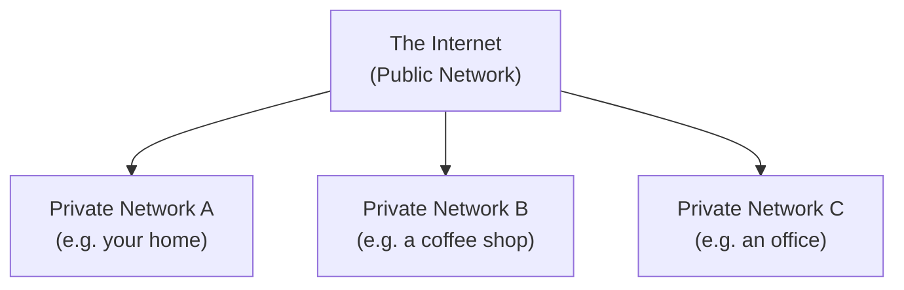

# 🌐 What is Networking?

> [!info] Room Info
> **Difficulty:** Info · **Time:** ~30 min · **Module:** Networking (new module — first room)
> Goal: Understand what a network is, how the Internet formed, how devices identify themselves (IP/MAC addresses), and use `ping` to test connectivity.

---

## 1. What Is Networking?

> [!quote] Core Idea
> **Networks are simply things connected.** Your friendship circle is a network — connected by shared interests. Networking in computing is the same idea, applied to devices.

### Everyday Networks
- A city's public transportation system
- The national power grid
- Meeting and greeting neighbours
- Postal systems

### Computer Networks
A network can range from **2 devices to billions** — laptops, phones, security cameras, traffic lights, even farming equipment. Networks are deeply embedded in modern life (weather data, electricity delivery, road right-of-way systems), which is exactly why **networking is essential in cybersecurity**.

> [!question]- 🧪 Quick Quiz: What Is Networking?
> 1. In the simplest terms, what is a network?
> 2. Name two everyday (non-computer) examples of networks.
> 3. Why does networking matter specifically for cybersecurity?
>
> **Answers**
> 1. Things connected together.
> 2. Any two of: public transportation, power grid, postal systems, social/community connections.
> 3. Because networks are so deeply embedded in modern infrastructure and daily life, understanding how they work is foundational to understanding how they can be attacked or defended.

---

## 2. What Is the Internet?

The **Internet** is one giant network made up of many smaller networks.

> [!example] The Alice/Bob/Jim/Zayn/Toby Analogy
> Alice, Bob, and Jim already form a network. Alice makes new friends — Zayn and Toby — who don't speak Bob and Jim's language. Since Alice speaks *both* languages, she becomes the bridge/messenger, forming a **new, larger network** connecting all five.

### A Brief History
| Milestone | Year | Significance |
|---|---|---|
| **ARPANET** | Late 1960s | First documented network in action, funded by the US Defence Department |
| **World Wide Web (WWW)** | 1989 | Invented by **Tim Berners-Lee** — marked the start of the Internet as a shared repository for storing/sharing information |

### Private vs. Public Networks



| Network Type | Description |
|---|---|
| **Private Network** | A small network (e.g. your home or office) |
| **Public Network** | The larger network connecting private networks together — i.e., **the Internet** |

> [!question]- 🧪 Quick Quiz: What Is the Internet?
> 1. Who invented the World Wide Web, and in what year?
> 2. What was ARPANET, and who funded it?
> 3. What's the difference between a private and a public network?
> 4. In the Alice/Bob/Jim/Zayn/Toby analogy, what role does Alice play?
>
> **Answers**
> 1. Tim Berners-Lee, in 1989.
> 2. The first documented network, funded by the US Defence Department, in the late 1960s.
> 3. A private network is a small network (e.g. home/office); a public network is the larger network — the Internet — connecting private networks together.
> 4. The bridge/messenger — connecting two groups that otherwise couldn't communicate directly, forming one unified network.

---

## 3. Identifying Devices on a Network

Devices need to be identifiable to communicate meaningfully — just like humans use two forms of identity:

| Human Identifier | Device Equivalent | Can It Change? |
|---|---|---|
| **Name** (can change via deed poll) | **IP Address** | ✅ Yes |
| **Fingerprint** (unique, unchangeable) | **MAC Address** | ❌ No (by design — though it can be *spoofed*) |

### IP Addresses

An **IP (Internet Protocol) address** identifies a host on a network — it can change over time and be reassigned to a different device, but only one device can actively use a given IP within the same network at once.

**Structure:** An IPv4 address = 4 numbers ("octets") separated by dots, e.g. `192.168.1.77`.

### Public vs. Private IP Addresses

| Type | Identifies | Assigned By |
|---|---|---|
| **Private IP** | A device *among other devices* on the same local network | The local router/network |
| **Public IP** | The device (or network) *on the Internet* | Your **ISP** (Internet Service Provider) — often at a monthly fee |

**Example — two devices sharing one public IP:**

| Device Name | IP Address | Type |
|---|---|---|
| DESKTOP-KJE57FD | `192.168.1.77` | Private |
| DESKTOP-KJE57FD | `86.157.52.21` | Public |
| CMNatic-PC | `192.168.1.74` | Private |
| CMNatic-PC | `86.157.52.21` | Public |

> [!tip] Same Public IP, Different Private IPs
> Devices on the same home network use their own **private** IPs to talk to each other, but share **one public IP** when talking to the Internet — that public IP is what identifies your whole network externally.

### IPv4 vs. IPv6

| Version | Address Space | Notes |
|---|---|---|
| **IPv4** | 2³² ≈ **4.29 billion** addresses | Original scheme — running short as device count explodes (Cisco estimated ~50 billion connected devices by end of 2021) |
| **IPv6** | 2¹²⁸ ≈ **340 trillion+** addresses | Newer scheme, solves the shortage, more efficient |

### MAC Addresses

Every device has a **network interface** (a chip on the motherboard) assigned a unique **MAC (Media Access Control) address** at the factory.

**Format:** 12-character hexadecimal number, split into pairs separated by colons — e.g. `a4:c3:f0:85:ac:2d`

| Section | Meaning |
|---|---|
| First 6 characters | Identifies the manufacturer |
| Last 6 characters | A unique device identifier |

> [!warning] MAC Spoofing
> MAC addresses **can be faked ("spoofed")** — a device pretends to be another by copying its MAC address. This can break security setups that trust devices based solely on MAC address.
>
> **Example:** A firewall allows traffic to/from an admin's MAC address. If an attacker spoofs that MAC, the firewall treats their traffic as if it came from the admin.

> [!example] Real-World Use: Paid Wi-Fi
> Cafes/hotels sometimes use MAC address control on "Guest" Wi-Fi to charge per device or offer tiered service — spoofing your MAC to match a paying device's is a classic way this gets bypassed (illustrated by the room's hotel Wi-Fi lab).

> [!question]- 🧪 Quick Quiz: Identifying Devices
> 1. What does "IP" stand for?
> 2. What is each section of an IPv4 address called, and how many are there?
> 3. Why can a public IP be shared by multiple devices on the same network, while private IPs can't?
> 4. What does "MAC" stand for?
> 5. What does the first half of a MAC address represent? The second half?
> 6. How many possible addresses does IPv4 support, and why is that becoming a problem?
> 7. What is MAC spoofing, and why is it a security risk?
>
> **Answers**
> 1. Internet Protocol.
> 2. Each section is called an octet; there are 4.
> 3. The public IP identifies the *network as a whole* to the outside Internet; private IPs identify each device *individually* within that local network — they serve different purposes.
> 4. Media Access Control.
> 5. First half = manufacturer identifier; second half = unique device number.
> 6. ~4.29 billion (2³²) — becoming insufficient as the number of connected devices worldwide vastly exceeds that.
> 7. Faking/copying another device's MAC address to impersonate it — risky because some security systems (e.g. firewalls) trust devices based purely on MAC address, so spoofing can bypass those controls.

---

## 4. Ping (ICMP)

**Ping** is a fundamental network diagnostic tool using **ICMP (Internet Control Message Protocol)** packets to test whether a connection between devices exists and how reliable it is.

### How It Works
1. Your device sends an **ICMP echo packet** to the target
2. The target responds with an **ICMP echo reply**
3. Ping measures the round-trip time

### Syntax

```bash
ping <IP address or website URL>
```

Example: `ping 192.168.1.254` → sends ICMP packets, reports how many were sent/received and the average round-trip time (e.g. 4.16 ms).

> [!tip] Built In Everywhere
> `ping` comes pre-installed on virtually every OS — Linux, Windows, macOS — no extra tools needed.

> [!question]- 🧪 Quick Quiz: Ping (ICMP)
> 1. What protocol does `ping` use?
> 2. What's the basic syntax for pinging an address?
> 3. What two ICMP packet types are involved in a single ping exchange?
> 4. What does ping actually measure?
>
> **Answers**
> 1. ICMP (Internet Control Message Protocol).
> 2. `ping <IP address or website URL>`
> 3. Echo packet (sent) and echo reply (received back).
> 4. Whether a connection exists between two devices, and how fast/reliable that connection is (round-trip time).

---

## 🧠 Key Takeaways
- A **network** is simply things connected — computer networking applies that idea to devices, from 2 up to billions.
- The **Internet** is one giant network made of many smaller **private networks**, joined via the **public network** (the Internet itself). WWW (1989, Tim Berners-Lee) is what made it a shared information repository.
- Devices are identified two ways: **IP address** (like a name — can change) and **MAC address** (like a fingerprint — fixed, but spoofable).
- **Public IP** = identifies you on the Internet (via ISP); **Private IP** = identifies you among devices on your local network.
- **IPv4** (4.29B addresses) is running out; **IPv6** (340T+ addresses) is the modern fix.
- **MAC spoofing** exploits systems that trust devices purely by MAC address — a real security weakness.
- **`ping`** uses ICMP echo request/reply to test connectivity and measure latency.

## 📝 Full Module Recap Quiz
> [!question]- End-to-End Review (test yourself without peeking at the sections above)
> 1. Define "network" in one sentence and give two real-world (non-tech) examples.
> 2. Explain how the Internet relates to private and public networks.
> 3. Compare IP addresses and MAC addresses — which changes, which doesn't, and why does that distinction matter?
> 4. What's the structure of an IPv4 address, and why was IPv6 created?
> 5. Explain MAC spoofing and one real-world scenario where it matters.
> 6. What protocol does `ping` rely on, and what does a successful ping tell you?

## 🔗 Related Notes
- [[Client-Server Basics]]
- [[What is an Operating System]]
- [[Offensive Security Intro]]
- [[Intro to LAN]]
- [[Networking MOC]]

## 📌 Next Steps
- [ ] Run `ping 8.8.8.8` on your own machine and interpret the output
- [ ] Check your own device's private IP (`ipconfig` on Windows / `ip a` on Linux — covered in [[Windows CLI Basics]] / [[Linux CLI Basics]]) and compare it to your public IP (searchable via "what is my IP")
- [ ] Continue to the "Intro to LAN" room
- [ ] Revisit quiz sections for spaced repetition
