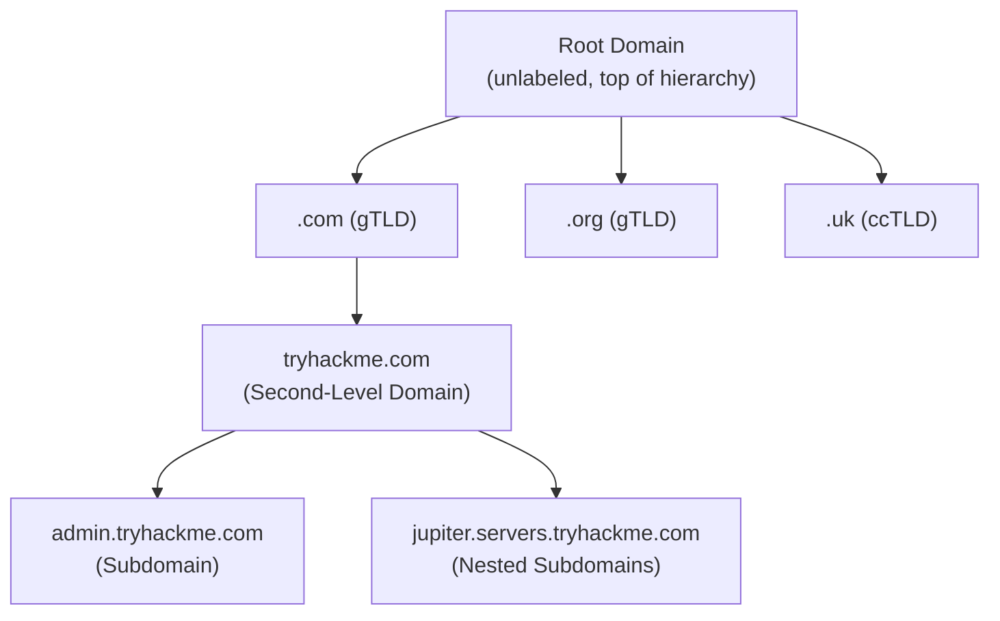
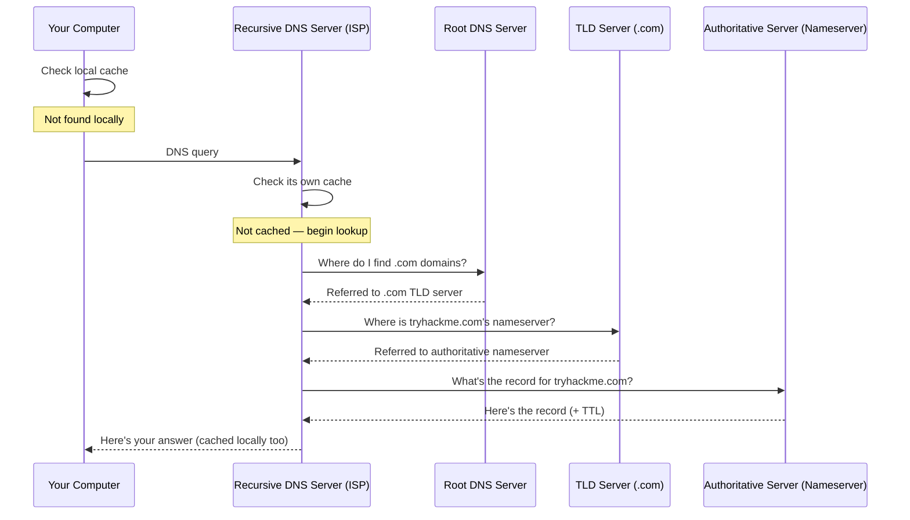

# 🗺️ DNS in Detail

> [!info] Room Info
> **Difficulty:** Easy · **Time:** ~45 min · **Module:** Networking (follows [[Port Forwarding Firewalls VPNs LAN Devices]])
> Goal: Understand what DNS is, how domain names are structured, the common DNS record types, and the full journey of a DNS request.

---

## 1. What Is DNS?

**DNS (Domain Name System)** lets you communicate with devices on the Internet without memorizing numeric addresses.

> [!tip] Postal Address Analogy
> Every house has a unique address for mail delivery. Every device on the Internet has a unique **IP address** (e.g. `104.26.10.229`) — four sets of digits (0–255) separated by periods. DNS lets you use `tryhackme.com` instead of memorizing that number.

> [!note] Ties Back
> This directly builds on IP addressing from [[What is Networking]] — DNS is the human-friendly lookup layer sitting on top of raw IP addresses.

---

## 2. Domain Hierarchy



### TLD (Top-Level Domain)
The right-most part of a domain name — e.g. in `tryhackme.com`, the TLD is `.com`.

| TLD Type | Meaning | Examples |
|---|---|---|
| **gTLD** (Generic) | Historically indicated purpose | `.com` (commercial), `.org` (organization), `.edu` (education), `.gov` (government) |
| **ccTLD** (Country Code) | Indicates geography | `.ca` (Canada), `.co.uk` (United Kingdom) |

> [!note] TLD Explosion
> Due to demand, many new gTLDs now exist beyond the traditional set: `.online`, `.club`, `.website`, `.biz`, and 2000+ more (full list via IANA).

### Second-Level Domain
In `tryhackme.com`, `tryhackme` is the Second-Level Domain.

> [!note] Naming Rules
> Max **63 characters** (before the TLD); only `a-z`, `0-9`, and hyphens; **cannot** start/end with a hyphen or contain consecutive hyphens.

### Subdomain
Sits to the *left* of the Second-Level Domain, separated by a period — e.g. `admin` in `admin.tryhackme.com`.

| Rule | Detail |
|---|---|
| Same character rules as Second-Level Domain | `a-z`, `0-9`, hyphens; no leading/trailing/consecutive hyphens |
| Max length per subdomain label | 63 characters |
| Max length of the **full domain name** | 253 characters |
| Number of subdomains allowed | Unlimited (can chain multiple, e.g. `jupiter.servers.tryhackme.com`) |

> [!question]- 🧪 Quick Quiz: Domain Hierarchy
> 1. What does DNS stand for, and what problem does it solve?
> 2. What's the difference between a gTLD and a ccTLD? Give one example of each.
> 3. In `admin.tryhackme.com`, identify the TLD, Second-Level Domain, and subdomain.
> 4. What's the maximum length of a single subdomain label? Of the entire domain name?
> 5. Which characters are disallowed in a subdomain?
>
> **Answers**
> 1. Domain Name System — it lets people use memorable domain names instead of numeric IP addresses.
> 2. gTLD indicates purpose (`.com`, `.org`, `.edu`, `.gov`); ccTLD indicates geography (`.ca`, `.co.uk`).
> 3. TLD = `.com`; Second-Level Domain = `tryhackme`; subdomain = `admin`.
> 4. 63 characters per subdomain label; 253 characters for the full domain name.
> 5. Anything outside `a-z`, `0-9`, and hyphens — and hyphens can't start/end a label or appear consecutively.

---

## 3. DNS Record Types

DNS isn't just for websites — several record types exist for different purposes.

| Record Type | Resolves To | Example |
|---|---|---|
| **A** | IPv4 address | `104.26.10.229` |
| **AAAA** | IPv6 address | `2606:4700:20::681a:be5` |
| **CNAME** | Another domain name (alias) | `store.tryhackme.com` → `shops.shopify.com` (triggers a second lookup) |
| **MX** | Mail server address (+ priority) | `alt1.aspmx.l.google.com` |
| **TXT** | Free-form text data | SPF/DKIM/DMARC records, domain ownership verification tokens |

> [!tip] CNAME Chains
> A CNAME doesn't resolve directly to an IP — it points to *another domain name*, which then needs its **own** DNS lookup to finally reach an IP address. This can chain more than once.

> [!note] MX Records Have Priority
> MX records include a **priority flag**, telling the client which mail server to try first — useful for automatic failover if the primary mail server is down.

> [!example] TXT Record Examples
> ```
> _acme-challenge.example.com TXT "token_value_here"
> @ TXT "v=spf1 ip4:192.0.2.0/24 include:_spf.google.com include:amazonses.com ~all"
> _dmarc.example.com TXT "v=DMARC1; p=reject; rua=mailto:dmarc-reports@example.com; adkim=s; aspf=s; pct=100"
> @ TXT "MS=ms12345678"
> ```
> Common uses: SPF (authorize which servers can send mail for a domain — anti-spoofing), DMARC (email authentication policy), and third-party domain ownership verification.

> [!question]- 🧪 Quick Quiz: DNS Record Types
> 1. What's the difference between an A record and an AAAA record?
> 2. Why might a CNAME record require a second DNS lookup?
> 3. What does the priority field on an MX record control?
> 4. Name two real-world uses of a TXT record.
> 5. Which record type would you check to find out where to send email for a domain?
>
> **Answers**
> 1. A resolves to an IPv4 address; AAAA resolves to an IPv6 address.
> 2. Because a CNAME points to *another domain name*, not directly to an IP — that target domain then needs its own lookup to resolve to an actual IP address.
> 3. Which mail server to try first — enabling automatic failover to a backup server if the primary is unavailable.
> 4. Any two of: SPF (authorizing legitimate mail senders, anti-spoofing), DMARC (email authentication policy), domain ownership verification for third-party services.
> 5. MX record.

---

## 4. Making a DNS Request — The Full Journey



### Step-by-Step Breakdown

| Step | What Happens |
|---|---|
| **1. Local cache check** | Your computer checks if it already looked this up recently |
| **2. Recursive DNS Server** | Usually provided by your ISP (or a chosen alternative) — has its own cache. If found here, the journey ends — this is common for popular sites (Google, Facebook, etc.) |
| **3. Root DNS servers** | The Internet's DNS backbone — redirects you to the correct **TLD server** based on the domain's TLD (e.g. `.com`) |
| **4. TLD server** | Holds records pointing to the **authoritative server (nameserver)** for the specific domain |
| **5. Authoritative DNS server** | The actual source of truth — stores the DNS records for that domain, and where updates are made. Response flows back through the Recursive server (which caches it) to your device |

> [!example] Real Example
> The nameservers for `tryhackme.com` are `kip.ns.cloudflare.com` and `uma.ns.cloudflare.com` — multiple nameservers exist as **backups** in case one goes down.

> [!tip] TTL (Time To Live)
> Every DNS record includes a **TTL** value (in seconds) — how long the response should be cached locally before it needs to be looked up again. Caching avoids making a fresh DNS request every single time you communicate with a server.

> [!question]- 🧪 Quick Quiz: Making a DNS Request
> 1. What's the first thing your computer checks before making any DNS request?
> 2. Who typically provides your Recursive DNS Server?
> 3. What's the role of Root DNS servers?
> 4. What's the difference between a TLD server and an authoritative server?
> 5. What does TTL control, and why does caching matter?
> 6. Why do domains typically have multiple nameservers?
>
> **Answers**
> 1. Its own local cache, to see if the domain was recently looked up.
> 2. Your ISP (though you can choose an alternative provider).
> 3. Acting as the DNS backbone — redirecting requests to the correct TLD server based on the domain's TLD.
> 4. The TLD server points to *where* the authoritative server is; the authoritative server actually *holds* the domain's DNS records and is the source of truth.
> 5. TTL controls how long a DNS response is cached locally before requiring a fresh lookup; caching reduces the need to repeat the full DNS resolution process on every request.
> 6. Redundancy — if one nameserver goes down, others can still answer requests for that domain.

---

## 🧠 Key Takeaways
- **DNS** translates human-friendly domain names into numeric IP addresses.
- Domain structure, right to left: **TLD** (`.com`) → **Second-Level Domain** (`tryhackme`) → **Subdomain(s)** (`admin`, `jupiter.servers`).
- Key record types: **A** (IPv4), **AAAA** (IPv6), **CNAME** (alias to another domain), **MX** (mail server + priority), **TXT** (free text — SPF/DMARC/verification).
- A DNS request travels: **local cache → Recursive DNS Server → Root servers → TLD server → Authoritative server (nameserver)** — with caching (governed by **TTL**) at multiple points to speed up future lookups.
- Multiple nameservers per domain exist for redundancy.

## 📝 Full Module Recap Quiz
> [!question]- End-to-End Review (test yourself without peeking at the sections above)
> 1. Explain the full domain hierarchy using `jupiter.servers.tryhackme.com` as an example.
> 2. List all five DNS record types covered and what each resolves to.
> 3. Walk through the full journey of a DNS request from local cache to final answer.
> 4. What is TTL, and why does it matter for network performance?
> 5. Why might a CNAME lookup take an extra step compared to an A record lookup?
> 6. Why do critical infrastructure pieces like nameservers typically have redundancy built in?

## 🔗 Related Notes
- [[What is Networking]]
- [[Client-Server Basics]]
- [[Port Forwarding Firewalls VPNs LAN Devices]]
- [[OSI Model]]
- [[Networking Protocols - TCP UDP Packets Frames Ports]]
- [[Networking MOC]]

## 📌 Next Steps
- [ ] Run `nslookup` or `dig` on a real domain to see actual A/AAAA/MX/TXT records
- [ ] Check the TTL on a few popular domains and compare (e.g. a CDN-heavy site vs. a small personal site)
- [ ] Revisit quiz sections for spaced repetition
