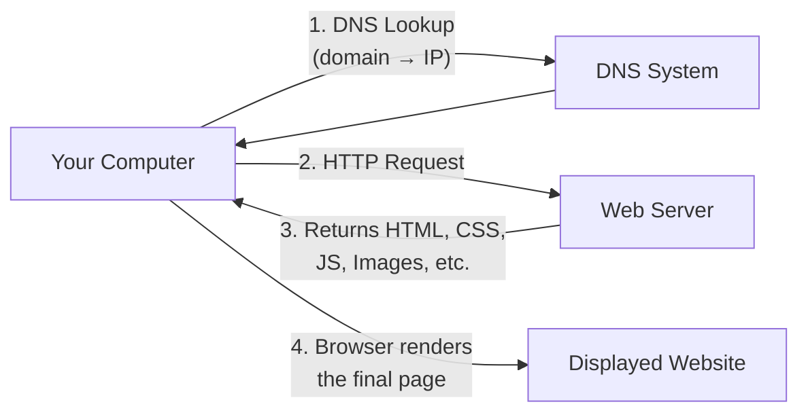
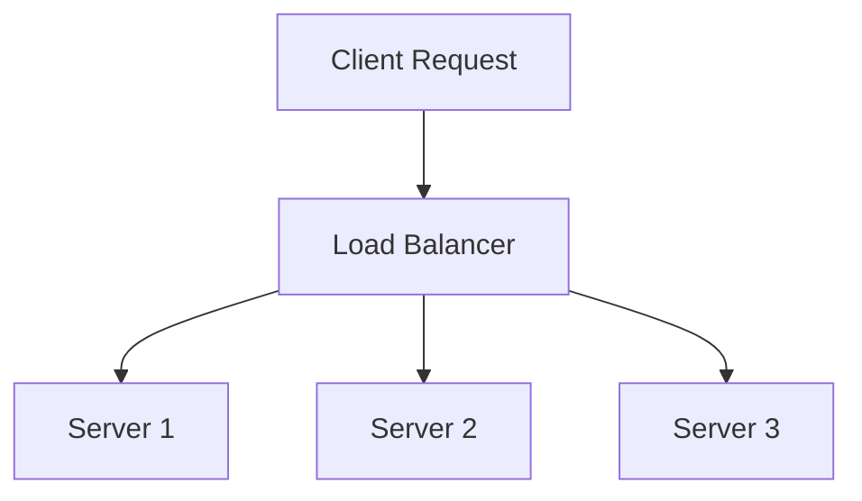
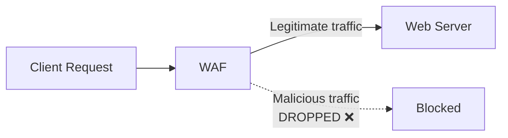
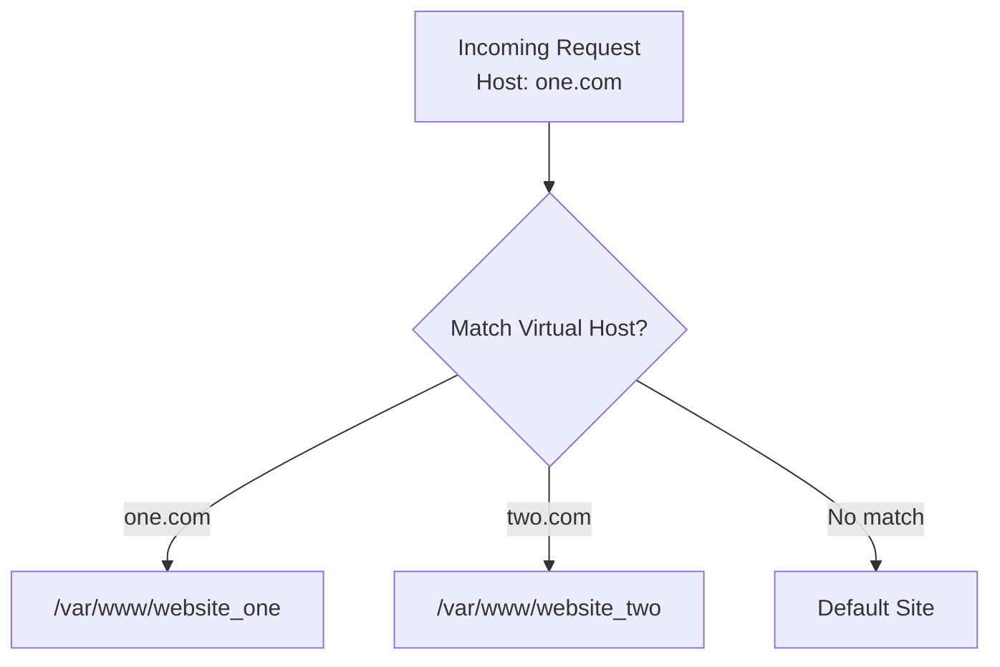

# 🏗️ Putting It All Together: Web Infrastructure

> [!info] Room Info
> **Module:** Web Fundamentals (follows [[How Websites Work]])
> Goal: Tie DNS, HTTP, and page rendering together into the full picture, then explore the extra infrastructure powering real-world websites — load balancers, CDNs, databases, WAFs — plus how web servers actually serve content (virtual hosts, static vs. dynamic content, backend languages).

---

## 1. Putting It All Together — The Full Request Flow



> [!success] Recap Across the Module
> 1. Your computer needs the server's **IP address** → uses **[[DNS in Detail|DNS]]**
> 2. Your computer talks to the server using **[[HTTP in Detail|HTTP]]**
> 3. The server returns **HTML, JavaScript, CSS, Images**, etc. (see [[How Websites Work]])
> 4. Your browser formats and displays all of it as the final webpage

This is the core loop — but real-world, high-traffic websites need **extra infrastructure** to run efficiently and stay resilient.

---

## 2. Other Components

### Load Balancers

Needed when traffic is too large or high availability is required — one server alone can't handle it (or shouldn't be a single point of failure).



**Two main features:**
1. **Handles high traffic** by distributing requests across multiple servers
2. **Provides failover** — if one server becomes unresponsive, traffic stops going to it

**Distribution algorithms:**

| Algorithm | How It Works |
|---|---|
| **Round-robin** | Sends requests to each server in turn, one after another |
| **Weighted** | Checks current load per server, sends new requests to the **least busy** one |

> [!tip] Health Checks
> Load balancers periodically **health-check** each server. If a server fails to respond correctly (or at all), the load balancer stops routing traffic to it until it recovers.

### CDN (Content Delivery Network)

Hosts **static files** (JS, CSS, images, videos) across **thousands of servers worldwide**, cutting down load on the origin server.

> [!success] How It Helps
> When a user requests a hosted file, the CDN identifies the **physically nearest server** and serves the file from there — instead of routing all the way to a potentially distant origin server. Faster delivery, less strain on any one server.

### Databases

Websites need to **store and recall** user/application data. Web servers communicate with databases to do this.

| Complexity | Example |
|---|---|
| Simple | A plain text file |
| Complex | Clustered, multi-server setups for speed + resilience |

**Common database systems:** MySQL, MSSQL, MongoDB, Postgres — each with its own strengths/use cases.

### WAF (Web Application Firewall)

Sits **between the client request and the web server** — protects against hacking attempts and denial-of-service attacks.



**What a WAF checks:**
- Common **attack technique** patterns in requests
- Whether the request comes from a **real browser vs. a bot**
- **Rate limiting** — caps how many requests per second an individual IP can send

> [!warning] Dropped, Not Delivered
> If a request is judged a potential attack, the WAF **drops it entirely** — it never reaches the web server.

> [!question]- 🧪 Quick Quiz: Other Components
> 1. What two main problems do load balancers solve?
> 2. Compare round-robin and weighted load balancing algorithms.
> 3. What happens during a load balancer's "health check," and what's the consequence of a failed check?
> 4. How does a CDN decide which server should serve a file to a given user?
> 5. Give two examples of common database systems.
> 6. What's the primary job of a WAF, and where does it sit in the request flow?
> 7. What is rate limiting, and why would a WAF use it?
>
> **Answers**
> 1. Handling high traffic volume by distributing load across multiple servers, and providing failover if a server becomes unresponsive.
> 2. Round-robin cycles through servers in a fixed order regardless of load; weighted checks current load and sends new requests to the least busy server.
> 3. The load balancer periodically checks each server's responsiveness; if a server fails to respond correctly, the load balancer stops sending it traffic until it recovers.
> 4. It determines the physically nearest server to the requesting user and routes the request there.
> 5. Any two of: MySQL, MSSQL, MongoDB, Postgres.
> 6. Protecting the web server from hacking/DoS attacks; it sits between the client request and the actual web server.
> 7. Limiting how many requests a single IP can send per second — used to prevent abuse/flooding from a single source.

---

## 3. How Web Servers Work

### What Is a Web Server?

Software that **listens for incoming connections** and delivers web content via HTTP. Common examples: **Apache, Nginx, IIS, NodeJS**.

### The Root Directory

Web servers deliver files from a configured **root directory**.

| Software | OS | Default Root Directory |
|---|---|---|
| Apache / Nginx | Linux | `/var/www/html` |
| IIS | Windows | `C:\inetpub\wwwroot` |

> [!example] How a Request Maps to a File
> Requesting `http://www.example.com/picture.jpg` → the server sends the file at `/var/www/html/picture.jpg` from its local disk.

### Virtual Hosts

Lets **one web server host multiple websites** with different domain names.

**How it works:**
1. The server checks the **Host header** in the incoming HTTP request (recall from [[HTTP in Detail]])
2. Matches it against configured virtual hosts (text-based config files)
3. Serves the matching site's content — or the **default site** if no match is found



> [!note] No Limit on Sites Per Server
> A single web server can host as many virtual hosts (websites) as configured — each mapped to its own root directory.

### Static vs. Dynamic Content

| Type | Description | Examples |
|---|---|---|
| **Static** | Never changes — served directly, no processing | Images, JS/CSS files, unchanging HTML |
| **Dynamic** | Changes depending on the request/context | Blog homepage (shows latest posts), search results page |

> [!tip] Where Dynamic Content Comes From
> Dynamic changes happen in the **Backend**, via programming/scripting logic — invisible to the client. What you actually see in the browser (the resulting HTML) is the **Frontend**; you can't view the backend logic itself, only its output.

### Scripting & Backend Languages

Backend languages give websites their **interactivity**. Common examples: **PHP, Python, Ruby, NodeJS, Perl**, and more. They can query databases, call external services, process user input, and much more.

> [!example] A Basic PHP Example
> Requesting: `http://example.com/index.php?name=adam`
>
> If `index.php` contains:
> ```php
> <html><body>Hello <?php echo $_GET["name"]; ?></body></html>
> ```
>
> The client receives:
> ```html
> <html><body>Hello adam</body></html>
> ```

> [!warning] The Client Never Sees the Backend Code
> The client only receives the **output** (`Hello adam`) — never the PHP logic that generated it. This is exactly why backend interactivity introduces significant **security risk**: if that logic isn't written securely (e.g. doesn't sanitize the `name` parameter — recall [[How Websites Work|HTML Injection]]), it can be exploited, even though the vulnerable code itself stays hidden from casual inspection.

> [!question]- 🧪 Quick Quiz: How Web Servers Work
> 1. Name two common web server software examples.
> 2. What is a "root directory," and give the default path for Nginx/Apache on Linux.
> 3. How does a web server decide which virtual host to serve for an incoming request?
> 4. What happens if no virtual host matches the requested hostname?
> 5. What's the key difference between static and dynamic content?
> 6. Why is dynamic content processing called "Backend" work?
> 7. In the PHP example, why does the client never see the actual PHP code?
> 8. Why does backend interactivity introduce more security risk than pure static content?
>
> **Answers**
> 1. Any two of: Apache, Nginx, IIS, NodeJS.
> 2. The configured base folder a web server serves files from; Nginx/Apache default to `/var/www/html` on Linux.
> 3. By checking the **Host header** in the incoming HTTP request against its configured virtual host mappings.
> 4. The server serves its **default website** instead.
> 5. Static content never changes and is served as-is; dynamic content changes depending on the specific request/context, generated via backend processing.
> 6. Because the processing happens "behind the scenes," invisible from the client's perspective — only the resulting HTML output is visible (the Frontend).
> 7. The server executes the PHP code and only sends the **resulting output** (plain HTML) to the client — the source code itself is never transmitted.
> 8. Because backend code processes and reacts to user input — if that input isn't handled securely, it opens the door to exploitation (e.g. injection attacks), even though the vulnerable logic is hidden from view.

---

## 🧠 Key Takeaways
- Full request flow: **DNS (find IP) → HTTP request/response → browser renders HTML/CSS/JS/images**.
- **Load balancers** distribute traffic across multiple servers (round-robin or weighted) and provide failover via health checks.
- **CDNs** host static assets across global servers, serving users from the nearest location.
- **Databases** store/retrieve application data — ranging from flat files to complex clusters (MySQL, MongoDB, Postgres, etc.).
- **WAFs** sit in front of the web server, filtering malicious requests via pattern detection, bot detection, and rate limiting.
- **Web servers** (Apache, Nginx, IIS, NodeJS) serve files from a root directory; **virtual hosts** let one server host many domains via the HTTP Host header.
- **Static content** = unchanging, served directly. **Dynamic content** = generated per-request by **backend** languages (PHP, Python, Ruby, NodeJS, Perl) — the client only ever sees the resulting output, never the backend logic itself.

## 📝 Full Module Recap Quiz
> [!question]- End-to-End Review (test yourself without peeking at the sections above)
> 1. Trace the complete journey of a website request from typing a URL to seeing the rendered page, naming every major component involved (DNS, HTTP, load balancer, CDN, WAF, web server, database, backend language).
> 2. Compare load balancers, CDNs, and WAFs — what problem does each solve, and where does each sit in the request flow?
> 3. Explain virtual hosts and how a single server can serve multiple distinct websites.
> 4. Compare static and dynamic content with an example of each.
> 5. Why can't a client see the backend code that generates dynamic content, and why does this matter for security?

## 🔗 Related Notes
- [[How Websites Work]]
- [[HTTP in Detail]]
- [[DNS in Detail]]
- [[Client-Server Basics]]
- [[Port Forwarding Firewalls VPNs LAN Devices]]
- [[Web Fundamentals MOC]]

## 📌 Next Steps
- [ ] Use `curl -I` or browser DevTools to check the `Server` header of a few real websites and identify which web server software they run
- [ ] Look up which CDN provider (e.g. Cloudflare, Akamai, Fastly) a favorite website uses
- [ ] Revisit quiz sections for spaced repetition
