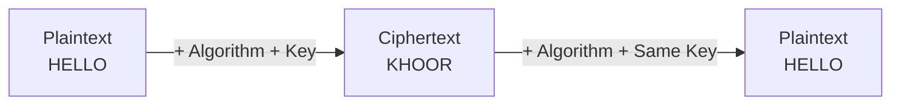
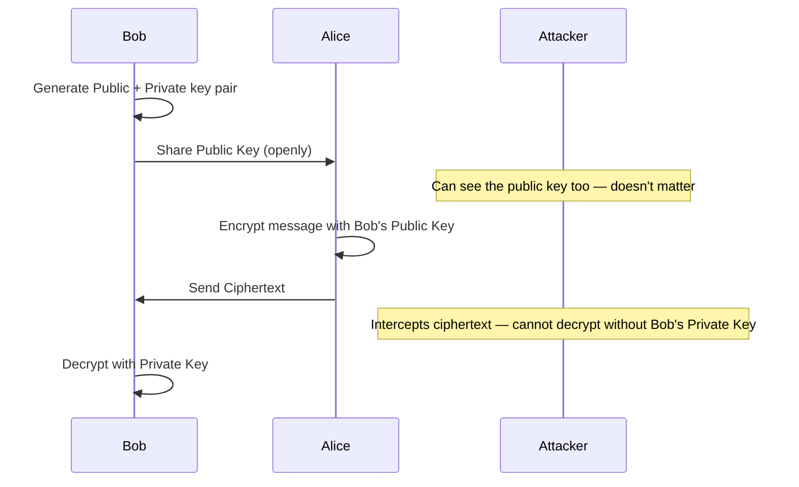
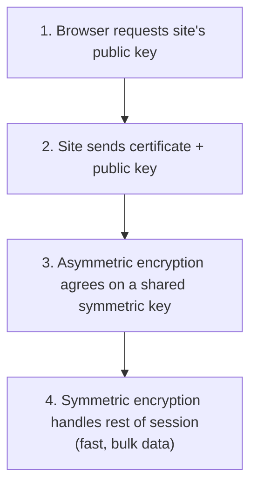

# 🔐 Cryptography Concepts

> [!info] Room Info
> **Difficulty:** Easy · **Time:** ~60 min · **Module:** Cyber Security (follows [[The CIA Triad]])
> Goal: Understand what cryptography actually does, the difference between symmetric and asymmetric encryption, and how both combine to power HTTPS.

---

## 1. Introduction

> [!quote] Opening Question
> When you see the padlock icon in your browser's address bar, what's actually stopping someone from reading or modifying your data as it travels across the Internet?

### Why Cryptography Matters

Recall the **CIA Triad** from [[The CIA Triad]] — Confidentiality, Integrity, Availability. Attackers try to break these through disclosure, alteration, and destruction. **Cryptography** is the practical toolset for protecting secrets and detecting tampering — directly defending Confidentiality and Integrity.

> [!example] Real-World Scenario
> A small medical clinic sends patient records to specialists/insurers over the Internet. Data doesn't travel directly — it bounces through dozens of computers and routers along the way. Without protection, anyone with access to those systems could read, change, or block the data. Cryptography scrambles the information into gibberish that only authorized parties can unscramble.

### Learning Objectives
- Explain what cryptography is and why it matters for confidentiality and integrity
- Describe the difference between plaintext and ciphertext
- Explain what keys and algorithms are, and why key secrecy is critical
- Explain symmetric vs. asymmetric encryption using everyday analogies
- Describe how both work together to protect web browsing (HTTPS)

### Prerequisites
- [[The CIA Triad]]
- Data Encoding *(not yet covered in this vault)*

---

## 2. Hiding Information — Symmetric Encryption

> [!quote] Opening Question
> If someone's listening to every piece of data traveling between two people, how can those two people still share secrets?

### Core Terms

| Term | Definition | Example |
|---|---|---|
| **Plaintext** | A message you can read normally | `HELLO` |
| **Ciphertext** | A scrambled version that shouldn't make sense | `KHOOR` |
| **Key** | The secret ingredient controlling scrambling/unscrambling — like a password the algorithm uses | e.g. the number `3` |
| **Algorithm** | The *public* recipe — the steps for using the key on the message | Caesar shift, AES, etc. |

> [!success] The Core Pattern
> **Encryption:** plaintext + encryption algorithm + key → ciphertext
> **Decryption:** ciphertext + decryption algorithm + key → plaintext

### The Lockbox Analogy

| Lockbox Element | Crypto Equivalent |
|---|---|
| How the lock mechanism works | **Algorithm** — public, not secret |
| Your specific metal key | **Key** — private, must stay secret |
| The letter inside the box | **Plaintext** |
| The locked box in transit | **Ciphertext** |

> [!tip] Security Comes From the Key, Not Secrecy of Design
> Nobody hides *how locks work* to make them secure — security comes from keeping the specific key private. The same applies to cryptography: **algorithms are public and tested by experts worldwide; security comes from keeping keys secret.**

**Alice sending Bob a secret letter through the public postal system:**
1. Writes her message (**plaintext**) on paper
2. Puts it in a sturdy lockbox
3. Locks it with her key
4. Sends the locked box (**ciphertext**) through the mail

Bob unlocks it with his copy of the **same key**. Anyone intercepting it along the way just sees a locked box — useless without the key.

> [!success] Symmetric Encryption, Defined
> **One key locks the box, the same key unlocks it.**

### Plaintext vs. Ciphertext Example

Alice's plaintext: `HELLO` → scrambled with an algorithm + secret key → ciphertext: `KHOOR`

> [!note] The Whole Point
> Ciphertext should look like **random nonsense** to anyone without the key.

### The Caesar Cipher — Algorithm + Key, Concretely

Named after Julius Caesar, who reportedly used it over 2,000 years ago for military messages.

> [!tip] How It Works
> Shifts each letter in the message by a **fixed number of positions** in the alphabet — that fixed number is the **key**. Letters wrap around at the end (`X`, `Y`, `Z` → `A`, `B`, `C` with a shift of 3).

**Encrypting `HELLO` with key = 3:**

| Plain | H | E | L | L | O |
|---|---|---|---|---|---|
| Cipher | K | H | O | O | R |

**Decrypting `KHOOR`** — shift each letter **backwards** by 3 → back to `HELLO`.

| Caesar Cipher Component | Public or Secret? |
|---|---|
| The algorithm (shift by some number) | **Public** |
| The key (the specific number, e.g. 3) | **Secret** |

> [!warning] Not Secure — Educational Only
> If someone intercepts `KHOOR` without the key, they'd need to try all 25 possible shifts — trivial for a computer (~1 millisecond). **The Caesar cipher is never used in real systems.** It's used here purely to demonstrate how keys and algorithms interact. Real algorithms like **AES** (Advanced Encryption Standard) are vastly more complex, but follow the same basic pattern: algorithm + key + plaintext → ciphertext.

### Symmetric Encryption — Properties

- The **same key** encrypts and decrypts
- Both sender and receiver need a copy of that key
- The key must stay secret from everyone else

| Advantages | The Catch |
|---|---|
| **Fast** — churns through huge data volumes quickly | **Key distribution problem**: how do Alice and Bob safely share the key in the first place? |
| **Efficient** — ideal for files, hard drives, network traffic | Sending the key in plaintext lets an eavesdropper grab it and decrypt everything going forward |

> [!warning] The Key Distribution Problem
> You might think "just encrypt the key" — but then you need *another* key to encrypt *that* key, and so on: **infinite regress.** This is the Achilles' heel of symmetric encryption used alone — solved next by **asymmetric encryption**.

> [!question]- 🧪 Quick Quiz: Symmetric Encryption
> 1. Define plaintext, ciphertext, key, and algorithm.
> 2. In the lockbox analogy, what represents the key, and what represents the algorithm?
> 3. Encrypt `CYBER` using a Caesar cipher with key = 5.
> 4. Why is the Caesar cipher considered insecure for real-world use?
> 5. What are the two main advantages of symmetric encryption?
> 6. What is the "key distribution problem," and why can't you solve it by just encrypting the key?
>
> **Answers**
> 1. Plaintext = readable message; Ciphertext = scrambled version; Key = the secret controlling scrambling/unscrambling; Algorithm = the public method for applying the key.
> 2. The key = your specific metal key (secret); the algorithm = how the lock mechanism works generally (public/known).
> 3. `H`→`M`, `C`→`H`, no wait — letter by letter: C→H, Y→D, B→G, E→J, R→W → **`HDGJW`**.
> 4. Only 25 possible shift values exist — trivially brute-forceable by a computer in about a millisecond.
> 5. Speed and efficiency for encrypting large volumes of data.
> 6. It's the challenge of safely sharing a symmetric key before any secure channel exists; encrypting the key just requires another key, leading to infinite regress rather than a solution.

---

## 3. Sharing Keys Safely — Asymmetric Encryption

> [!quote] Opening Question
> If Alice and Bob have never met and can't safely send a key over the Internet, how can they start encrypting messages to each other?

### Two Keys Instead of One

**Asymmetric encryption** uses **two mathematically linked keys**:

| Key | Who Has It | Purpose |
|---|---|---|
| **Public key** | Anyone | Used to *encrypt* messages to that person |
| **Private key** | Only the owner, kept secret | Used to *decrypt* messages sent to them |

> [!success] The Clever Part
> - Encrypt with someone's **public key** → only their **private key** can decrypt it.
> - Encrypt with your **private key** → anyone with your **public key** can decrypt it (used for **digital signatures** — not covered in depth here).

The two keys are mathematically linked, but recovering the private key from the public key would take an ordinary computer **hundreds or thousands of years** — this computational difficulty is what makes asymmetric encryption secure.

### The Mailbox Analogy

| Mailbox Element | Crypto Equivalent |
|---|---|
| Mail slot (anyone can drop a letter in) | **Public key** — open, accessible to all |
| Locked door (only the owner has the key) | **Private key** — secret, only the owner can retrieve contents |

**Alice sending Bob a secret:**
1. Alice finds Bob's **public key** (not secret — he can post it anywhere)
2. Alice encrypts her message with Bob's public key and sends it
3. Only Bob can decrypt it, since only he holds the matching **private key**

> [!success] Solving the Key Distribution Problem
> Alice and Bob **never need to share a secret key beforehand**. The only key that travels publicly (Bob's public key) isn't secret by design — so there's nothing valuable for an eavesdropper to intercept.

### Real-World Use: HTTPS

The everyday use of asymmetric encryption — the padlock in your browser.

**Visiting `https://google.com`:**
1. Your browser requests the site's public key
2. The site sends back its public key wrapped in a **certificate**
3. Browser + website use asymmetric encryption to agree on a **shared secret** (a symmetric key) — invisibly, securely
4. From there, they switch to **fast symmetric encryption** using that shared secret for the rest of the session

> [!success] The Hybrid Approach
> - **Asymmetric encryption** solves key distribution (the initial handshake)
> - **Symmetric encryption** handles the heavy lifting afterward (fast, bulk data)

### Certificates — Verifying "Is This Really Bob?"

A **certificate** is a digital document that:
- Contains someone's public key
- States who the key belongs to (e.g. `example.com`)
- Is digitally signed by a trusted **Certificate Authority (CA)**

**Your browser validates a certificate by checking:**
- Was it signed by a **trusted CA**? (Browsers/OSes come preloaded with a trusted CA list)
- Is it still **valid** (not expired or revoked)?

If everything checks out → padlock shown, connection trusted. If something's off (expired, untrusted signer) → browser shows a **warning** and may refuse to connect.

> [!tip] Viewing a Real Certificate
> Visit any HTTPS site → click the padlock icon → look for "Certificate" / "Connection is secure" / "View certificate" → see **Issued to**, **Issued by** (the CA), and **Valid from/until** dates.

### Symmetric vs. Asymmetric — Side by Side

| Feature | Symmetric Encryption | Asymmetric Encryption |
|---|---|---|
| **Number of keys** | One (shared) | Two (public + private) |
| **Key sharing** | Both parties need the same secret key | Public key can be shared openly |
| **Speed** | Very fast | Slower — used for small amounts of data |
| **Main use** | Bulk data (files, network traffic) | Key sharing, digital certificates |
| **Analogy** | One key locks/unlocks a box | Mailbox: anyone posts, only owner retrieves |

> [!success] Real Systems Use Both
> Asymmetric encryption **initiates** a connection and securely shares a symmetric key; symmetric encryption **takes over** for the rest of the session. This exact pattern runs **HTTPS, VPNs, and encrypted messaging apps**.

> [!question]- 🧪 Quick Quiz: Asymmetric Encryption & HTTPS
> 1. In asymmetric encryption, which key must stay secret?
> 2. True or false: Alice can encrypt with Bob's public key, and only Bob's private key can decrypt it.
> 3. What specific problem does asymmetric encryption solve that symmetric encryption alone cannot?
> 4. After the initial asymmetric handshake in HTTPS, which encryption type takes over for actual data transfer, and why?
> 5. What is a certificate, and what three things does it typically state/verify?
> 6. What happens if your browser can't validate a site's certificate?
>
> **Answers**
> 1. The private key.
> 2. True.
> 3. The key distribution problem — safely establishing a shared secret without ever having to transmit it insecurely.
> 4. Symmetric encryption — because it's much faster and better suited to handling large volumes of data efficiently.
> 5. A digital document containing a public key, stating who it belongs to, and signed by a trusted Certificate Authority (CA) — verifying the site's identity.
> 6. It displays a warning and may refuse to connect, since it can't confirm you're talking to the legitimate site rather than an impersonator.

---

## 4. Conclusion

### What We've Covered
- **Plaintext** = readable; **ciphertext** = scrambled gibberish
- **Key** = the secret controlling scrambling/unscrambling; **algorithm** = the public method
- **Symmetric encryption**: one shared key, fast, but has the key distribution problem (demonstrated via the Caesar cipher)
- **Asymmetric encryption**: public + private key pair, solves key distribution, powers the HTTPS handshake
- **Real systems combine both**: asymmetric sets up a shared key, symmetric handles the actual data

> [!success] The Big Picture
> Cryptography protects the passwords, banking details, and messages behind that browser padlock. But it's **one layer** in a much bigger security picture — also including strong password practices, secure key storage, user awareness/training, regular updates, and monitoring/incident response.

### Further Learning
The next rooms in this module — **Become a Hacker** and **Become a Defender** — cover offensive and defensive security concepts.

---

## 🧠 Key Takeaways
- Cryptography defends **Confidentiality** (via encryption) and **Integrity** (via tamper-detection) — the CIA Triad in action.
- **Symmetric encryption**: one key, fast, efficient — but the key distribution problem makes it hard to safely establish that shared key in the first place.
- **Asymmetric encryption**: public/private key pair — solves key distribution, but slower — used to *establish* trust, not to encrypt bulk data.
- **HTTPS = hybrid approach**: asymmetric encryption for the handshake, symmetric encryption for the actual session data.
- **Certificates + Certificate Authorities** verify that a public key genuinely belongs to who it claims to — without this, asymmetric encryption alone can't stop impersonation.
- The Caesar cipher is a teaching tool only — real systems use algorithms like **AES** (symmetric) and **RSA/ECC**-style systems (asymmetric).

## 📝 Full Module Recap Quiz
> [!question]- End-to-End Review (test yourself without peeking at the sections above)
> 1. Define plaintext, ciphertext, key, and algorithm, and explain which of these must stay secret.
> 2. Walk through the full Caesar cipher encryption/decryption process with a key of your choice.
> 3. Explain the key distribution problem and how asymmetric encryption solves it.
> 4. Trace the full HTTPS handshake process from initial connection to ongoing encrypted communication.
> 5. What is a certificate, and why can't asymmetric encryption alone guarantee you're talking to the right person without one?
> 6. Compare symmetric and asymmetric encryption across key count, speed, and typical use case.
> 7. Which CIA Triad pillars does cryptography most directly protect, and how?

## 🔗 Related Notes
- [[The CIA Triad]]
- [[HTTP in Detail]]
- [[How Websites Work]]
- [[TryHackMe MOC]]

## 📌 Next Steps
- [ ] View the certificate details of a real HTTPS site you visit (padlock icon → Certificate)
- [ ] Try manually encrypting/decrypting a short message with a Caesar cipher of your own choosing
- [ ] Continue to the "Become a Hacker" and "Become a Defender" rooms
- [ ] Revisit quiz sections for spaced repetition
