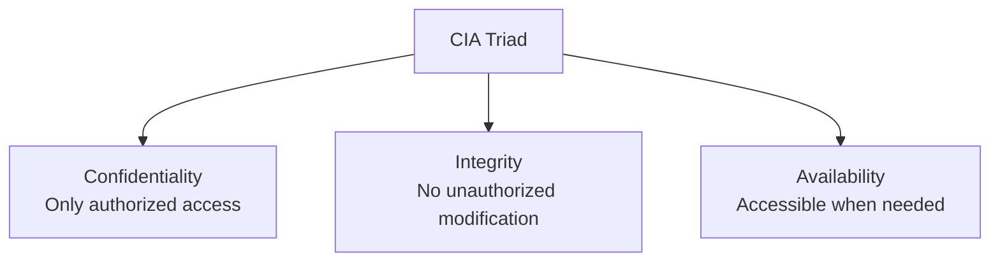

# 🔺 The CIA Triad

> [!info] Room Info
> **Difficulty:** Easy · **Time:** ~30 min · **Module:** Cyber Security (new module — builds on everything in [[TryHackMe MOC]])
> Goal: Understand the three pillars of cyber security — Confidentiality, Integrity, Availability — and start applying the CIA mindset to real incidents.

---

## 1. Introduction

Cyber security is often described as "protecting systems, networks, and applications from attacks" — but what does it actually **protect**, conceptually? The answer is three core properties of digital data, together called the **CIA Triad**.

### Learning Objectives
- Understand the pillars of cyber security
- Understand the purpose of Confidentiality, Integrity, and Availability
- Recognize each pillar in simple real-world scenarios
- Make decisions that preserve these core aspects of cyber security

> [!tip] The Milestone
> This room marks the transition from **fundamentals** (computers, OS, networking, web) into **actual cyber security thinking** — the previous modules taught you *how digital systems work*; this one teaches you *what you're actually defending* when you secure them.

---

## 2. Understanding the CIA Triad

Historically, sensitive information lived on paper. Today it's digital data — stored on systems, transmitted over networks — and vulnerable in ways paper never was: exposed to the wrong people, silently modified, or made unreachable exactly when it's needed.

> [!success] Security ≠ Just "Stopping Attacks"
> Being secure means ensuring specific **conditions** hold for data. Those conditions are:
> - **Confidentiality**
> - **Integrity**
> - **Availability**

Together, these three principles define what cyber security actually protects — the **CIA Triad**. Virtually everything you encounter going forward (attacking or defending) ultimately maps back to preserving — or breaking — one of these three pillars.

### Confidentiality

Ensures sensitive data is accessible **only to authorized individuals**. If broken: financial loss, privacy violations, legal consequences.

> [!example] Real-World Analogy
> A private conversation with a friend is deliberately overheard by a stranger, who later uses that information to manipulate you. The information reached someone with no right to hear it — confidentiality harmed.

> [!example] Digital World Analogy
> You log into social media on a coffee shop's public WiFi. Minutes later, you're locked out — someone intercepted your credentials over the network. Confidentiality harmed.

> [!note] How It's Enforced
> Techniques like **encryption** and **access controls** protect confidentiality in the digital world — you'll encounter both in depth later in your cyber security journey.

| Situation | Confidentiality Achieved? |
|---|---|
| Gmail credentials written on sticky notes on an office desk | ❌ No |
| Internal company documents available only to employees who need them | ✅ Yes |
| A personal document ends up publicly available on the internet | ❌ No |

### Integrity

Ensures data is **not modified by unauthorized individuals**. Without integrity, data can no longer be trusted — and unauthorized changes can have serious consequences.

> [!example] Real-World Analogy
> A teacher gives you a good exam grade, but someone alters it before it's submitted to the examination authority. Integrity breached.

> [!example] Digital World Analogy
> You initiate a bank transfer from your phone. Before it completes, someone intercepts and modifies the receiving account — your money goes somewhere it was never meant to. Integrity breached.

| Situation | Integrity Achieved? |
|---|---|
| Data changed through authorized approval | ✅ Yes |
| Attendance records altered after being locked by the teacher | ❌ No |
| Order price modified before checkout | ❌ No |

### Availability

Ensures data/services are accessible to **authorized users when needed**. Just as important as the other two — for businesses relying on digital services, even short downtime can be devastating.

> [!example] Real-World Analogy
> Your money sits securely in a bank — but the bank is closed the one day you desperately need it, due to a power failure. Secure, but **unavailable** — which makes it functionally useless to you in that moment.

> [!example] Digital World Analogy
> Attackers flood a website with more requests than it can handle, taking it offline. No data leaked, nothing modified — but the **compromise of availability** alone causes real business loss. *(This is a Denial-of-Service pattern — you've already seen the defensive side of this in the [[Port Forwarding Firewalls VPNs LAN Devices|stateless firewall / DDoS]] discussion.)*

| Situation | Availability Achieved? |
|---|---|
| Critical services disrupted by a software installation | ❌ No |
| Company website goes offline during business hours | ❌ No |
| All systems accessible to employees during working hours | ✅ Yes |

> [!question]- 🧪 Quick Quiz: Understanding the CIA Triad
> 1. Which pillar focuses on preventing unauthorized *modification* of data?
> 2. Which pillar focuses on preventing unauthorized *access* to data?
> 3. Which pillar ensures data is reachable when users actually need it?
> 4. If data becomes untrustworthy (possibly altered), which pillar has been compromised?
> 5. What's the collective term for these three pillars?
> 6. In the bank power-failure analogy, why is "secure but inaccessible" still considered a security failure?
>
> **Answers**
> 1. Integrity.
> 2. Confidentiality.
> 3. Availability.
> 4. Integrity.
> 5. The CIA Triad.
> 6. Because security isn't just about protecting data from bad actors — it must also remain usable by its legitimate owner. Total inaccessibility, even without any breach, defeats the actual purpose of the system.

---

## 3. The Security Mindset

The CIA Triad isn't just a set of definitions — it's the actual **mental framework** security professionals use to assess incidents. When something goes wrong, professionals ask:

- Was **sensitive data exposed** to unauthorized individuals? → **Confidentiality**
- Was **data modified** without permission? → **Integrity**
- Were **systems/services unavailable** when users needed them? → **Availability**

> [!success] Why This Matters
> Having a clear grasp of each pillar lets you **assess the impact** of any security incident and decide on an appropriate response — this is the core analytical skill underlying almost all further cyber security work.

> [!tip] Practical Habit
> Whenever you read about a breach, hack, or outage going forward — in this vault or in real news — try classifying it against C/I/A first. It's a fast, repeatable way to structure your understanding of *any* security incident.

> [!question]- 🧪 Quick Quiz: The Security Mindset
> 1. What three questions does a security professional typically ask when assessing an incident?
> 2. Why is the CIA Triad described as a "mindset" rather than just a definition?
>
> **Answers**
> 1. Was sensitive data exposed? Was data modified without permission? Were systems/services unavailable when needed?
> 2. Because it's an active analytical framework applied to real incidents to assess impact and guide response — not just a static piece of terminology to memorize.

---

## 🧠 Key Terminology Recap

| Term | Definition |
|---|---|
| **Confidentiality** | Ensuring digital information is not available to unauthorized individuals |
| **Integrity** | Ensuring digital information is not modified without permission |
| **Availability** | Ensuring digital information is not unavailable when needed |

## 🧠 Key Takeaways
- Cyber security exists to protect three properties of data: **Confidentiality, Integrity, Availability** — the **CIA Triad**.
- **Confidentiality** = only the right people can access it (enforced via encryption, access controls).
- **Integrity** = only authorized changes happen to it (data stays trustworthy).
- **Availability** = it's accessible to legitimate users when needed (uptime, redundancy, capacity).
- Every security incident can be classified by which pillar(s) it breaks — this is the core diagnostic lens professionals use.
- A system can be perfectly confidential and have perfect integrity, and *still* be a security failure if it's unavailable — all three pillars matter independently.

## 📝 Full Module Recap Quiz
> [!question]- End-to-End Review (test yourself without peeking at the sections above)
> 1. Define all three pillars of the CIA Triad in your own words.
> 2. Give one real-world (non-digital) and one digital-world example of each pillar being violated.
> 3. Classify each of these incidents by CIA pillar: (a) a hacker leaks a customer database, (b) a ransomware attack encrypts all company files, (c) an employee secretly changes a financial record before an audit.
> 4. Why does having a strong grasp of the CIA Triad matter for assessing *any* future security incident you encounter?
> 5. Explain why "secure but inaccessible" is still a security failure.

## 🔗 Related Notes
- [[Introduction to Operating System Security]]
- [[How Websites Work]]
- [[Port Forwarding Firewalls VPNs LAN Devices]]
- [[TryHackMe MOC]]

## 📌 Next Steps
- [ ] Classify a recent real-world data breach headline against the CIA Triad
- [ ] Continue to the next room in the Cyber Security module
- [ ] Revisit quiz sections for spaced repetition
